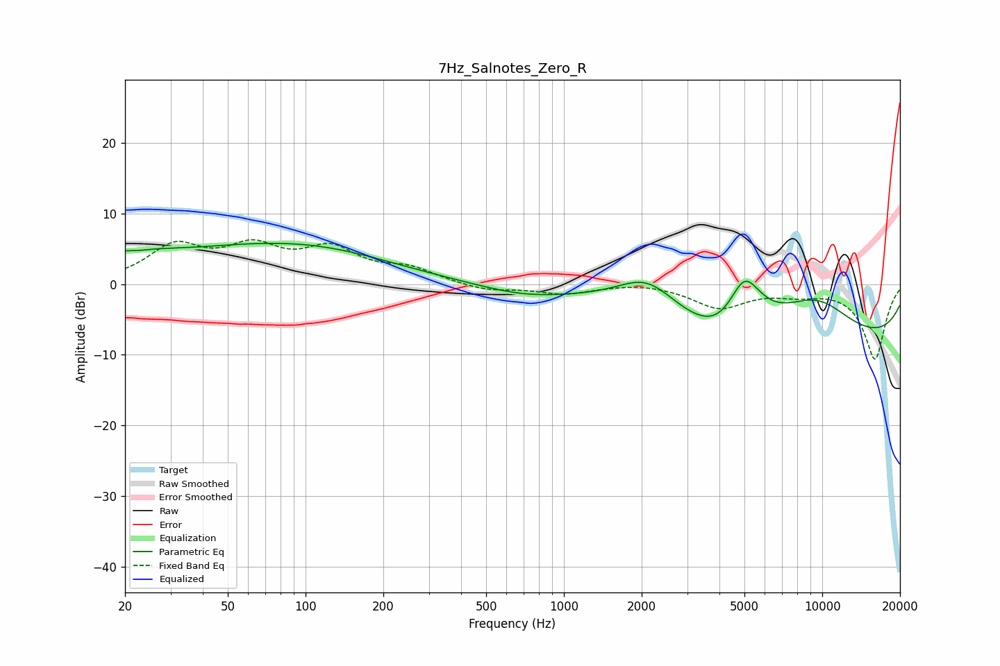

# 7Hz_Salnotes_Zero_R
See [usage instructions](https://github.com/jaakkopasanen/AutoEq#usage) for more options and info.

### Parametric EQs
Apply preamp of -5.9 dB when using parametric equalizer.

|   # | Type    |   Fc (Hz) |    Q |   Gain (dB) |
|-----|---------|-----------|------|-------------|
|   1 | Peaking |        23 | 4.83 |        -0.1 |
|   2 | Peaking |        37 | 1.05 |        -0.3 |
|   3 | Peaking |        38 | 0.2  |         5.1 |
|   4 | Peaking |       117 | 0.52 |         1.5 |
|   5 | Peaking |       694 | 0.83 |        -1.3 |
|   6 | Peaking |      2102 | 1.18 |         4.9 |
|   7 | Peaking |      4393 | 1.04 |        -5.7 |
|   8 | Peaking |      4986 | 1.8  |        10.4 |
|   9 | Peaking |      9399 | 0.8  |         6.3 |
|  10 | Peaking |      9916 | 0.18 |        -8.9 |

### Fixed Band EQs
When using fixed band (also called graphic) equalizer, apply preamp of **-6.4 dB** (if available) and set gains manually with these parameters.

|   # | Type    |   Fc (Hz) |    Q |   Gain (dB) |
|-----|---------|-----------|------|-------------|
|   1 | Peaking |        31 | 1.41 |         5   |
|   2 | Peaking |        62 | 1.41 |         4.5 |
|   3 | Peaking |       125 | 1.41 |         4.4 |
|   4 | Peaking |       250 | 1.41 |         1.9 |
|   5 | Peaking |       500 | 1.41 |        -1   |
|   6 | Peaking |      1000 | 1.41 |        -1.3 |
|   7 | Peaking |      2000 | 1.41 |         0.4 |
|   8 | Peaking |      4000 | 1.41 |        -3.2 |
|   9 | Peaking |      8000 | 1.41 |        -1   |
|  10 | Peaking |     16000 | 1.41 |       -10.6 |

### Graphs

