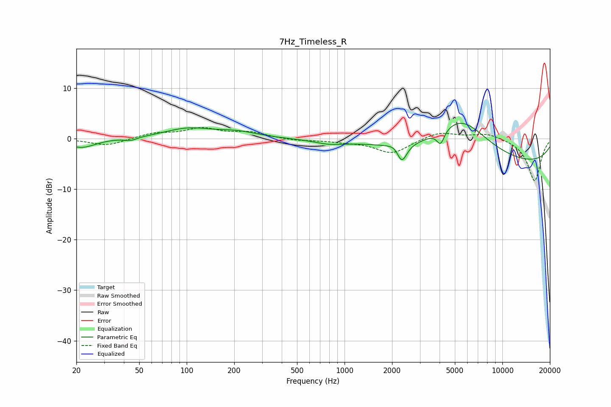

# 7Hz_Timeless_R
See [usage instructions](https://github.com/jaakkopasanen/AutoEq#usage) for more options and info.

### Parametric EQs
Apply preamp of -3.1 dB when using parametric equalizer.

|   # | Type    |   Fc (Hz) |    Q |   Gain (dB) |
|-----|---------|-----------|------|-------------|
|   1 | Peaking |        22 | 1.62 |        -1.8 |
|   2 | Peaking |        44 | 3.72 |        -0.6 |
|   3 | Peaking |       102 | 0.95 |         1.9 |
|   4 | Peaking |       207 | 1.07 |         1.1 |
|   5 | Peaking |       797 | 1.53 |        -0.7 |
|   6 | Peaking |      2126 | 3.94 |         1.1 |
|   7 | Peaking |      2299 | 4.36 |        -4.1 |
|   8 | Peaking |      4060 | 5.9  |        -2.7 |
|   9 | Peaking |      5457 | 0.78 |         8.3 |
|  10 | Peaking |      9437 | 0.18 |        -5.4 |

### Fixed Band EQs
When using fixed band (also called graphic) equalizer, apply preamp of **-2.3 dB** (if available) and set gains manually with these parameters.

|   # | Type    |   Fc (Hz) |    Q |   Gain (dB) |
|-----|---------|-----------|------|-------------|
|   1 | Peaking |        31 | 1.41 |        -1.4 |
|   2 | Peaking |        62 | 1.41 |         1   |
|   3 | Peaking |       125 | 1.41 |         1.9 |
|   4 | Peaking |       250 | 1.41 |         1.2 |
|   5 | Peaking |       500 | 1.41 |        -0.4 |
|   6 | Peaking |      1000 | 1.41 |        -0.5 |
|   7 | Peaking |      2000 | 1.41 |        -2.9 |
|   8 | Peaking |      4000 | 1.41 |         1.4 |
|   9 | Peaking |      8000 | 1.41 |         1.1 |
|  10 | Peaking |     16000 | 1.41 |        -8.4 |

### Graphs

