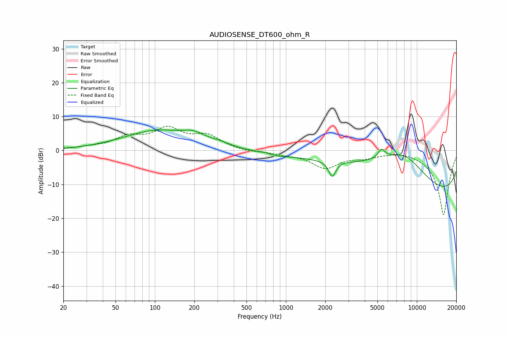

# AUDIOSENSE_DT600_ohm_R
See [usage instructions](https://github.com/jaakkopasanen/AutoEq#usage) for more options and info.

### Parametric EQs
Apply preamp of -6.2 dB when using parametric equalizer.

|   # | Type    |   Fc (Hz) |    Q |   Gain (dB) |
|-----|---------|-----------|------|-------------|
|   1 | Peaking |       102 | 0.56 |         5.6 |
|   2 | Peaking |       197 | 1.64 |         2.3 |
|   3 | Peaking |       309 | 1.77 |         1   |
|   4 | Peaking |       694 | 3.64 |         0.3 |
|   5 | Peaking |       849 | 2.06 |        -0.5 |
|   6 | Peaking |      2255 | 5.3  |        -4.6 |
|   7 | Peaking |      4669 | 0.3  |         5.8 |
|   8 | Peaking |      5366 | 5.05 |         2.6 |
|   9 | Peaking |      7974 | 0.64 |        10.7 |
|  10 | Peaking |      9815 | 0.18 |       -17.7 |

### Fixed Band EQs
When using fixed band (also called graphic) equalizer, apply preamp of **-7.2 dB** (if available) and set gains manually with these parameters.

|   # | Type    |   Fc (Hz) |    Q |   Gain (dB) |
|-----|---------|-----------|------|-------------|
|   1 | Peaking |        31 | 1.41 |         0.7 |
|   2 | Peaking |        62 | 1.41 |         3.5 |
|   3 | Peaking |       125 | 1.41 |         5.8 |
|   4 | Peaking |       250 | 1.41 |         4   |
|   5 | Peaking |       500 | 1.41 |        -0.5 |
|   6 | Peaking |      1000 | 1.41 |        -0.8 |
|   7 | Peaking |      2000 | 1.41 |        -4.9 |
|   8 | Peaking |      4000 | 1.41 |        -1.5 |
|   9 | Peaking |      8000 | 1.41 |         0.5 |
|  10 | Peaking |     16000 | 1.41 |       -19.1 |

### Graphs

