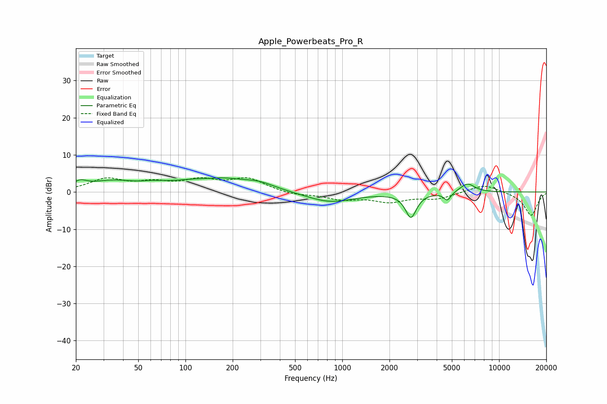

# Apple_Powerbeats_Pro_R
See [usage instructions](https://github.com/jaakkopasanen/AutoEq#usage) for more options and info.

### Parametric EQs
Apply preamp of -3.9 dB when using parametric equalizer.

|   # | Type    |   Fc (Hz) |    Q |   Gain (dB) |
|-----|---------|-----------|------|-------------|
|   1 | Peaking |        21 | 3.31 |         1.7 |
|   2 | Peaking |        34 | 0.97 |         2.5 |
|   3 | Peaking |        63 | 1.7  |         0.8 |
|   4 | Peaking |       138 | 1.92 |        -0.7 |
|   5 | Peaking |       147 | 0.71 |         3.9 |
|   6 | Peaking |       296 | 1.37 |         1.5 |
|   7 | Peaking |       837 | 0.93 |        -2.8 |
|   8 | Peaking |      2739 | 4.06 |        -6.6 |
|   9 | Peaking |      4675 | 6    |        -2.2 |
|  10 | Peaking |      6281 | 2.94 |         2.4 |

### Fixed Band EQs
When using fixed band (also called graphic) equalizer, apply preamp of **-4.0 dB** (if available) and set gains manually with these parameters.

|   # | Type    |   Fc (Hz) |    Q |   Gain (dB) |
|-----|---------|-----------|------|-------------|
|   1 | Peaking |        31 | 1.41 |         3.3 |
|   2 | Peaking |        62 | 1.41 |         2.1 |
|   3 | Peaking |       125 | 1.41 |         2.8 |
|   4 | Peaking |       250 | 1.41 |         3.4 |
|   5 | Peaking |       500 | 1.41 |        -0.8 |
|   6 | Peaking |      1000 | 1.41 |        -1.8 |
|   7 | Peaking |      2000 | 1.41 |        -2.4 |
|   8 | Peaking |      4000 | 1.41 |        -1.7 |
|   9 | Peaking |      8000 | 1.41 |         2.2 |
|  10 | Peaking |     16000 | 1.41 |        -6.4 |

### Graphs

