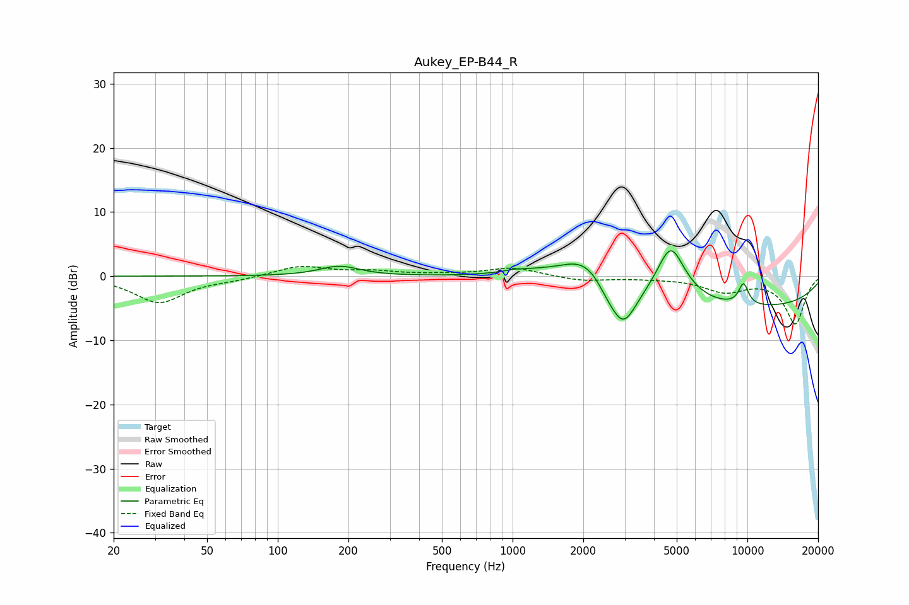

# Aukey_EP-B44_R
See [usage instructions](https://github.com/jaakkopasanen/AutoEq#usage) for more options and info.

### Parametric EQs
Apply preamp of -4.1 dB when using parametric equalizer.

|   # | Type    |   Fc (Hz) |    Q |   Gain (dB) |
|-----|---------|-----------|------|-------------|
|   1 | Peaking |       183 | 1.69 |         1.5 |
|   2 | Peaking |      1012 | 5.2  |         0.2 |
|   3 | Peaking |      1207 | 1.03 |         1.2 |
|   4 | Peaking |      1977 | 1.42 |         3.5 |
|   5 | Peaking |      2334 | 1.88 |         1.9 |
|   6 | Peaking |      2487 | 2.88 |        -1.7 |
|   7 | Peaking |      2949 | 2.37 |        -6.8 |
|   8 | Peaking |      4718 | 2.21 |         8.8 |
|   9 | Peaking |      9045 | 0.22 |        -5   |
|  10 | Peaking |      9627 | 5.79 |         3.3 |

### Fixed Band EQs
When using fixed band (also called graphic) equalizer, apply preamp of **-1.6 dB** (if available) and set gains manually with these parameters.

|   # | Type    |   Fc (Hz) |    Q |   Gain (dB) |
|-----|---------|-----------|------|-------------|
|   1 | Peaking |        31 | 1.41 |        -4.1 |
|   2 | Peaking |        62 | 1.41 |        -0.5 |
|   3 | Peaking |       125 | 1.41 |         1.6 |
|   4 | Peaking |       250 | 1.41 |         0.7 |
|   5 | Peaking |       500 | 1.41 |         0.2 |
|   6 | Peaking |      1000 | 1.41 |         1.3 |
|   7 | Peaking |      2000 | 1.41 |        -0.7 |
|   8 | Peaking |      4000 | 1.41 |        -0.2 |
|   9 | Peaking |      8000 | 1.41 |        -2.2 |
|  10 | Peaking |     16000 | 1.41 |        -7.4 |

### Graphs

