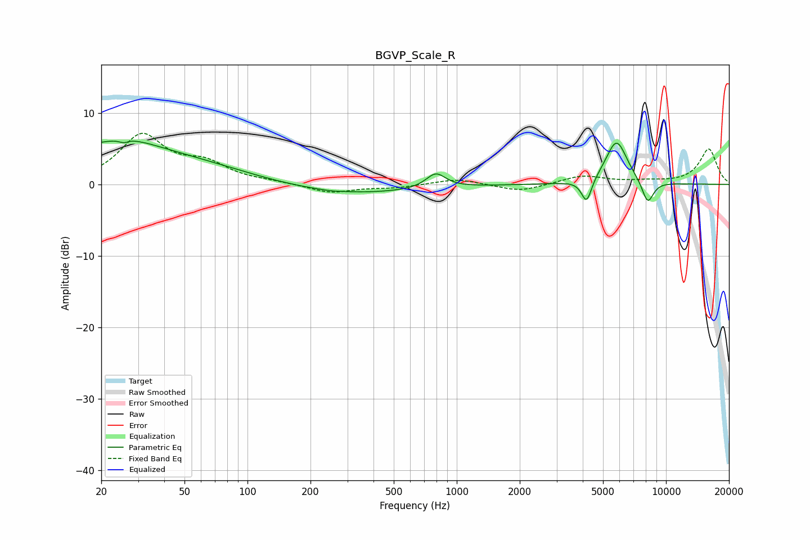

# BGVP_Scale_R
See [usage instructions](https://github.com/jaakkopasanen/AutoEq#usage) for more options and info.

### Parametric EQs
Apply preamp of -6.1 dB when using parametric equalizer.

|   # | Type    |   Fc (Hz) |    Q |   Gain (dB) |
|-----|---------|-----------|------|-------------|
|   1 | Peaking |        21 | 0.25 |         5   |
|   2 | Peaking |        26 | 5.99 |        -3.5 |
|   3 | Peaking |        26 | 5.9  |         3.1 |
|   4 | Peaking |        27 | 1.06 |         1.4 |
|   5 | Peaking |       252 | 3.83 |        -0.1 |
|   6 | Peaking |       298 | 0.43 |        -1.4 |
|   7 | Peaking |       795 | 3.05 |         2.1 |
|   8 | Peaking |      4175 | 5.78 |        -3.4 |
|   9 | Peaking |      5802 | 2.62 |         6.2 |
|  10 | Peaking |      8176 | 4.59 |        -3.3 |

### Fixed Band EQs
When using fixed band (also called graphic) equalizer, apply preamp of **-7.2 dB** (if available) and set gains manually with these parameters.

|   # | Type    |   Fc (Hz) |    Q |   Gain (dB) |
|-----|---------|-----------|------|-------------|
|   1 | Peaking |        31 | 1.41 |         6.7 |
|   2 | Peaking |        62 | 1.41 |         2.5 |
|   3 | Peaking |       125 | 1.41 |         0.3 |
|   4 | Peaking |       250 | 1.41 |        -1.2 |
|   5 | Peaking |       500 | 1.41 |        -0.4 |
|   6 | Peaking |      1000 | 1.41 |         0.8 |
|   7 | Peaking |      2000 | 1.41 |        -1   |
|   8 | Peaking |      4000 | 1.41 |         1.2 |
|   9 | Peaking |      8000 | 1.41 |         0.3 |
|  10 | Peaking |     16000 | 1.41 |         4.9 |

### Graphs

