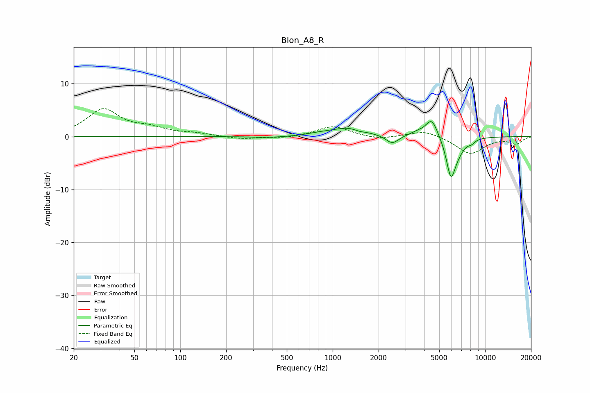

# Blon_A8_R
See [usage instructions](https://github.com/jaakkopasanen/AutoEq#usage) for more options and info.

### Parametric EQs
Apply preamp of -2.9 dB when using parametric equalizer.

|   # | Type    |   Fc (Hz) |    Q |   Gain (dB) |
|-----|---------|-----------|------|-------------|
|   1 | Peaking |       394 | 1.24 |        -0.3 |
|   2 | Peaking |       823 | 1.71 |         0.3 |
|   3 | Peaking |      1259 | 1.29 |         1.6 |
|   4 | Peaking |      1500 | 4.94 |        -0.3 |
|   5 | Peaking |      2458 | 3.44 |        -1.6 |
|   6 | Peaking |      3585 | 2.73 |         0.6 |
|   7 | Peaking |      4465 | 3.49 |         3.5 |
|   8 | Peaking |      5965 | 4.45 |        -7.2 |
|   9 | Peaking |      6692 | 3.12 |        -1.6 |
|  10 | Peaking |      8136 | 6    |        -0.6 |

### Fixed Band EQs
When using fixed band (also called graphic) equalizer, apply preamp of **-5.4 dB** (if available) and set gains manually with these parameters.

|   # | Type    |   Fc (Hz) |    Q |   Gain (dB) |
|-----|---------|-----------|------|-------------|
|   1 | Peaking |        31 | 1.41 |         5   |
|   2 | Peaking |        62 | 1.41 |         1.3 |
|   3 | Peaking |       125 | 1.41 |         0.5 |
|   4 | Peaking |       250 | 1.41 |        -0.5 |
|   5 | Peaking |       500 | 1.41 |        -0.3 |
|   6 | Peaking |      1000 | 1.41 |         2   |
|   7 | Peaking |      2000 | 1.41 |        -0.6 |
|   8 | Peaking |      4000 | 1.41 |         1.2 |
|   9 | Peaking |      8000 | 1.41 |        -3.3 |
|  10 | Peaking |     16000 | 1.41 |        -1.3 |

### Graphs

