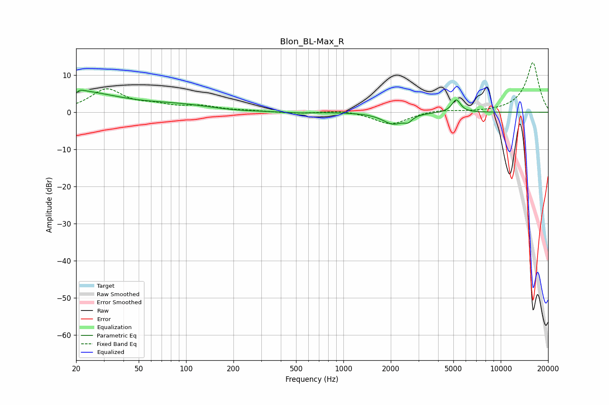

# Blon_BL-Max_R
See [usage instructions](https://github.com/jaakkopasanen/AutoEq#usage) for more options and info.

### Parametric EQs
Apply preamp of -6.0 dB when using parametric equalizer.

|   # | Type    |   Fc (Hz) |    Q |   Gain (dB) |
|-----|---------|-----------|------|-------------|
|   1 | Peaking |        20 | 5.95 |        -3.9 |
|   2 | Peaking |        20 | 1.41 |         0.3 |
|   3 | Peaking |        20 | 0.53 |         5.3 |
|   4 | Peaking |        20 | 5.69 |         3.4 |
|   5 | Peaking |        91 | 0.64 |         1.6 |
|   6 | Peaking |       195 | 1.09 |        -0.2 |
|   7 | Peaking |       517 | 1.86 |        -0.2 |
|   8 | Peaking |      2074 | 2.1  |        -3.1 |
|   9 | Peaking |      2577 | 5.95 |        -1.3 |
|  10 | Peaking |      5212 | 5.05 |         3.5 |

### Fixed Band EQs
When using fixed band (also called graphic) equalizer, apply preamp of **-13.4 dB** (if available) and set gains manually with these parameters.

|   # | Type    |   Fc (Hz) |    Q |   Gain (dB) |
|-----|---------|-----------|------|-------------|
|   1 | Peaking |        31 | 1.41 |         6   |
|   2 | Peaking |        62 | 1.41 |         1.4 |
|   3 | Peaking |       125 | 1.41 |         1.4 |
|   4 | Peaking |       250 | 1.41 |         0.3 |
|   5 | Peaking |       500 | 1.41 |        -0.4 |
|   6 | Peaking |      1000 | 1.41 |         0.6 |
|   7 | Peaking |      2000 | 1.41 |        -3.3 |
|   8 | Peaking |      4000 | 1.41 |         0.7 |
|   9 | Peaking |      8000 | 1.41 |        -0   |
|  10 | Peaking |     16000 | 1.41 |        13.5 |

### Graphs

