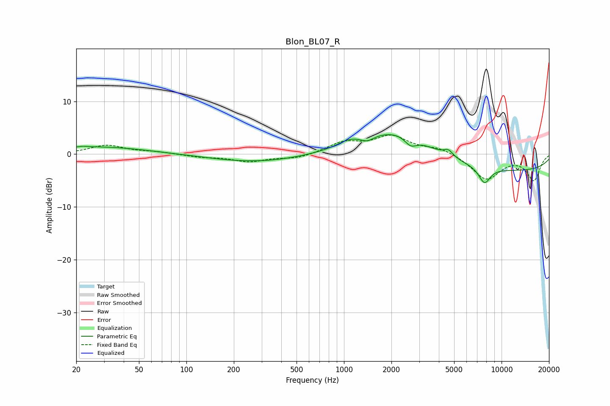

# Blon_BL07_R
See [usage instructions](https://github.com/jaakkopasanen/AutoEq#usage) for more options and info.

### Parametric EQs
Apply preamp of -3.8 dB when using parametric equalizer.

|   # | Type    |   Fc (Hz) |    Q |   Gain (dB) |
|-----|---------|-----------|------|-------------|
|   1 | Peaking |        22 | 5.53 |         0.2 |
|   2 | Peaking |        27 | 0.45 |         1.4 |
|   3 | Peaking |       279 | 0.48 |        -1.5 |
|   4 | Peaking |      1077 | 1.97 |         1.1 |
|   5 | Peaking |      1406 | 3.52 |        -0.9 |
|   6 | Peaking |      2192 | 0.62 |         5.5 |
|   7 | Peaking |      2651 | 3.63 |        -1.7 |
|   8 | Peaking |      4601 | 4.81 |         1.2 |
|   9 | Peaking |      7793 | 3.55 |        -3.1 |
|  10 | Peaking |     10000 | 0.2  |        -3.3 |

### Fixed Band EQs
When using fixed band (also called graphic) equalizer, apply preamp of **-3.7 dB** (if available) and set gains manually with these parameters.

|   # | Type    |   Fc (Hz) |    Q |   Gain (dB) |
|-----|---------|-----------|------|-------------|
|   1 | Peaking |        31 | 1.41 |         1.6 |
|   2 | Peaking |        62 | 1.41 |         0.4 |
|   3 | Peaking |       125 | 1.41 |        -0.5 |
|   4 | Peaking |       250 | 1.41 |        -1.3 |
|   5 | Peaking |       500 | 1.41 |        -0.8 |
|   6 | Peaking |      1000 | 1.41 |         2.1 |
|   7 | Peaking |      2000 | 1.41 |         3.2 |
|   8 | Peaking |      4000 | 1.41 |         1.2 |
|   9 | Peaking |      8000 | 1.41 |        -4.7 |
|  10 | Peaking |     16000 | 1.41 |        -4.8 |

### Graphs

