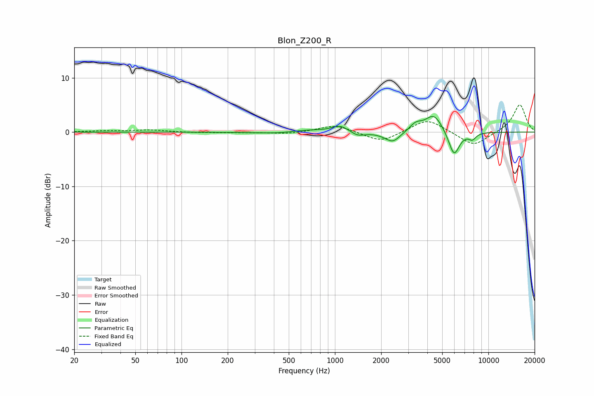

# Blon_Z200_R
See [usage instructions](https://github.com/jaakkopasanen/AutoEq#usage) for more options and info.

### Parametric EQs
Apply preamp of -3.0 dB when using parametric equalizer.

|   # | Type    |   Fc (Hz) |    Q |   Gain (dB) |
|-----|---------|-----------|------|-------------|
|   1 | Peaking |       426 | 1.02 |        -0.3 |
|   2 | Peaking |       650 | 1.28 |         0.4 |
|   3 | Peaking |      1082 | 2.62 |         1.2 |
|   4 | Peaking |      1408 | 3.23 |        -0.8 |
|   5 | Peaking |      2183 | 1.82 |        -0.2 |
|   6 | Peaking |      2385 | 2.95 |        -1.8 |
|   7 | Peaking |      3356 | 3.49 |         1.3 |
|   8 | Peaking |      4417 | 2.46 |         3.3 |
|   9 | Peaking |      5969 | 3.84 |        -4.6 |
|  10 | Peaking |      7855 | 5.63 |        -1.1 |

### Fixed Band EQs
When using fixed band (also called graphic) equalizer, apply preamp of **-5.1 dB** (if available) and set gains manually with these parameters.

|   # | Type    |   Fc (Hz) |    Q |   Gain (dB) |
|-----|---------|-----------|------|-------------|
|   1 | Peaking |        31 | 1.41 |         0.2 |
|   2 | Peaking |        62 | 1.41 |         0.4 |
|   3 | Peaking |       125 | 1.41 |        -0.1 |
|   4 | Peaking |       250 | 1.41 |        -0.1 |
|   5 | Peaking |       500 | 1.41 |        -0.3 |
|   6 | Peaking |      1000 | 1.41 |         1.4 |
|   7 | Peaking |      2000 | 1.41 |        -1.9 |
|   8 | Peaking |      4000 | 1.41 |         2.5 |
|   9 | Peaking |      8000 | 1.41 |        -2.7 |
|  10 | Peaking |     16000 | 1.41 |         5.1 |

### Graphs

