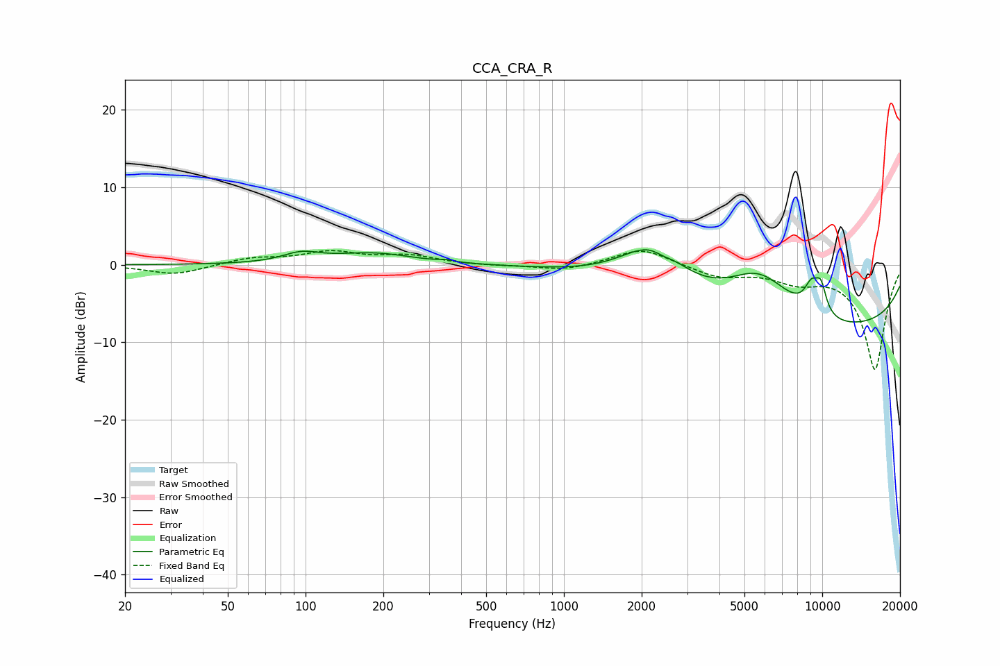

# CCA_CRA_R
See [usage instructions](https://github.com/jaakkopasanen/AutoEq#usage) for more options and info.

### Parametric EQs
Apply preamp of -2.0 dB when using parametric equalizer.

|   # | Type    |   Fc (Hz) |    Q |   Gain (dB) |
|-----|---------|-----------|------|-------------|
|   1 | Peaking |        96 | 2.02 |         1.2 |
|   2 | Peaking |       183 | 0.91 |         1.4 |
|   3 | Peaking |       352 | 5.27 |         0.2 |
|   4 | Peaking |      2228 | 1.04 |         6.6 |
|   5 | Peaking |      2410 | 4.22 |        -0.5 |
|   6 | Peaking |      5053 | 0.34 |        -2.6 |
|   7 | Peaking |      5702 | 0.96 |         7.3 |
|   8 | Peaking |      9100 | 4.37 |         3.3 |
|   9 | Peaking |      9889 | 5.86 |         3.3 |
|  10 | Peaking |     10000 | 0.18 |        -7.7 |

### Fixed Band EQs
When using fixed band (also called graphic) equalizer, apply preamp of **-1.9 dB** (if available) and set gains manually with these parameters.

|   # | Type    |   Fc (Hz) |    Q |   Gain (dB) |
|-----|---------|-----------|------|-------------|
|   1 | Peaking |        31 | 1.41 |        -1.3 |
|   2 | Peaking |        62 | 1.41 |         0.8 |
|   3 | Peaking |       125 | 1.41 |         1.5 |
|   4 | Peaking |       250 | 1.41 |         1.1 |
|   5 | Peaking |       500 | 1.41 |        -0.1 |
|   6 | Peaking |      1000 | 1.41 |        -0.8 |
|   7 | Peaking |      2000 | 1.41 |         2.2 |
|   8 | Peaking |      4000 | 1.41 |        -1.5 |
|   9 | Peaking |      8000 | 1.41 |        -1.8 |
|  10 | Peaking |     16000 | 1.41 |       -13.5 |

### Graphs

