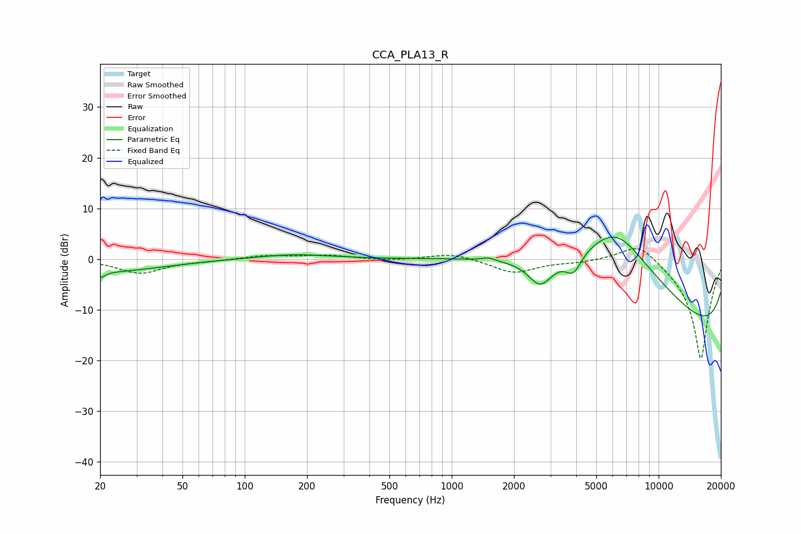

# CCA_PLA13_R
See [usage instructions](https://github.com/jaakkopasanen/AutoEq#usage) for more options and info.

### Parametric EQs
Apply preamp of -4.4 dB when using parametric equalizer.

|   # | Type    |   Fc (Hz) |    Q |   Gain (dB) |
|-----|---------|-----------|------|-------------|
|   1 | Peaking |        20 | 6    |        -1.3 |
|   2 | Peaking |        22 | 0.54 |        -2.4 |
|   3 | Peaking |       171 | 0.8  |         0.9 |
|   4 | Peaking |      1509 | 4.67 |         0.6 |
|   5 | Peaking |      2683 | 2.36 |        -5.4 |
|   6 | Peaking |      3877 | 3.68 |        -3.7 |
|   7 | Peaking |      5785 | 0.28 |         4.4 |
|   8 | Peaking |      6214 | 0.47 |        20   |
|   9 | Peaking |     10000 | 0.18 |        -8.5 |
|  10 | Peaking |     10000 | 0.18 |       -12.5 |

### Fixed Band EQs
When using fixed band (also called graphic) equalizer, apply preamp of **-2.1 dB** (if available) and set gains manually with these parameters.

|   # | Type    |   Fc (Hz) |    Q |   Gain (dB) |
|-----|---------|-----------|------|-------------|
|   1 | Peaking |        31 | 1.41 |        -2.8 |
|   2 | Peaking |        62 | 1.41 |        -0.3 |
|   3 | Peaking |       125 | 1.41 |         0.7 |
|   4 | Peaking |       250 | 1.41 |         0.7 |
|   5 | Peaking |       500 | 1.41 |        -0.3 |
|   6 | Peaking |      1000 | 1.41 |         1.2 |
|   7 | Peaking |      2000 | 1.41 |        -2.7 |
|   8 | Peaking |      4000 | 1.41 |        -0.5 |
|   9 | Peaking |      8000 | 1.41 |         3.9 |
|  10 | Peaking |     16000 | 1.41 |       -20   |

### Graphs

