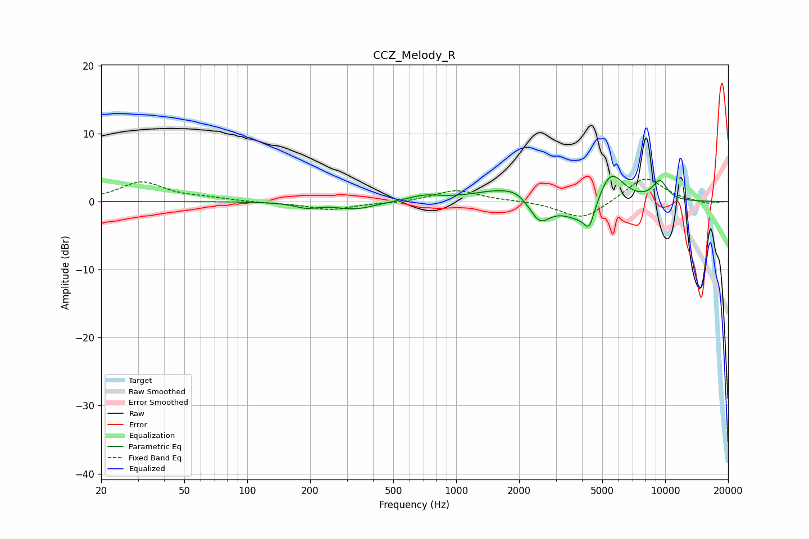

# CCZ_Melody_R
See [usage instructions](https://github.com/jaakkopasanen/AutoEq#usage) for more options and info.

### Parametric EQs
Apply preamp of -3.8 dB when using parametric equalizer.

|   # | Type    |   Fc (Hz) |    Q |   Gain (dB) |
|-----|---------|-----------|------|-------------|
|   1 | Peaking |       192 | 2.48 |        -0.8 |
|   2 | Peaking |       329 | 1.51 |        -1.1 |
|   3 | Peaking |       705 | 1.81 |         0.8 |
|   4 | Peaking |      1643 | 1.04 |         1.8 |
|   5 | Peaking |      1941 | 2.76 |         0.7 |
|   6 | Peaking |      2510 | 2.87 |        -3.2 |
|   7 | Peaking |      4136 | 1.41 |        -3.9 |
|   8 | Peaking |      4331 | 5.9  |        -2.7 |
|   9 | Peaking |      5443 | 2.08 |         5.9 |
|  10 | Peaking |      9436 | 3.52 |         2.8 |

### Fixed Band EQs
When using fixed band (also called graphic) equalizer, apply preamp of **-3.4 dB** (if available) and set gains manually with these parameters.

|   # | Type    |   Fc (Hz) |    Q |   Gain (dB) |
|-----|---------|-----------|------|-------------|
|   1 | Peaking |        31 | 1.41 |         2.8 |
|   2 | Peaking |        62 | 1.41 |         0.4 |
|   3 | Peaking |       125 | 1.41 |        -0.2 |
|   4 | Peaking |       250 | 1.41 |        -1.2 |
|   5 | Peaking |       500 | 1.41 |        -0.2 |
|   6 | Peaking |      1000 | 1.41 |         1.7 |
|   7 | Peaking |      2000 | 1.41 |         0.1 |
|   8 | Peaking |      4000 | 1.41 |        -2.7 |
|   9 | Peaking |      8000 | 1.41 |         3.7 |
|  10 | Peaking |     16000 | 1.41 |        -0.4 |

### Graphs

