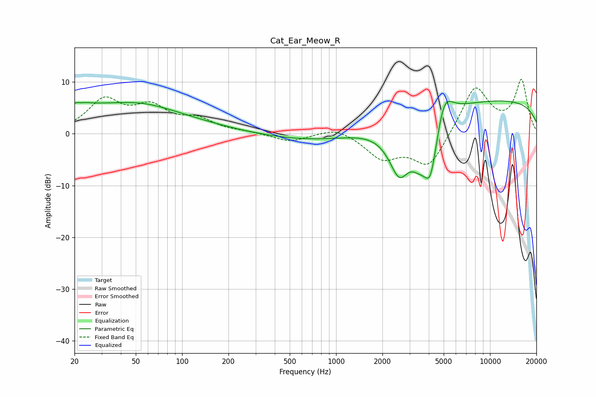

# Cat_Ear_Meow_R
See [usage instructions](https://github.com/jaakkopasanen/AutoEq#usage) for more options and info.

### Parametric EQs
Apply preamp of -6.4 dB when using parametric equalizer.

|   # | Type    |   Fc (Hz) |    Q |   Gain (dB) |
|-----|---------|-----------|------|-------------|
|   1 | Peaking |        22 | 5.23 |         3.6 |
|   2 | Peaking |        22 | 5.77 |        -3.3 |
|   3 | Peaking |        27 | 0.21 |         5.5 |
|   4 | Peaking |        57 | 0.85 |         1   |
|   5 | Peaking |       772 | 0.43 |        -1.5 |
|   6 | Peaking |      2572 | 1.97 |        -9.3 |
|   7 | Peaking |      3439 | 2.51 |        -3.4 |
|   8 | Peaking |      4102 | 2.55 |       -12.3 |
|   9 | Peaking |      5011 | 2.47 |         6.7 |
|  10 | Peaking |     10000 | 0.18 |         6.6 |

### Fixed Band EQs
When using fixed band (also called graphic) equalizer, apply preamp of **-10.6 dB** (if available) and set gains manually with these parameters.

|   # | Type    |   Fc (Hz) |    Q |   Gain (dB) |
|-----|---------|-----------|------|-------------|
|   1 | Peaking |        31 | 1.41 |         6.2 |
|   2 | Peaking |        62 | 1.41 |         4.6 |
|   3 | Peaking |       125 | 1.41 |         2.4 |
|   4 | Peaking |       250 | 1.41 |         0.3 |
|   5 | Peaking |       500 | 1.41 |        -1.6 |
|   6 | Peaking |      1000 | 1.41 |         1.5 |
|   7 | Peaking |      2000 | 1.41 |        -4.5 |
|   8 | Peaking |      4000 | 1.41 |        -6.6 |
|   9 | Peaking |      8000 | 1.41 |         9.3 |
|  10 | Peaking |     16000 | 1.41 |        10.1 |

### Graphs

