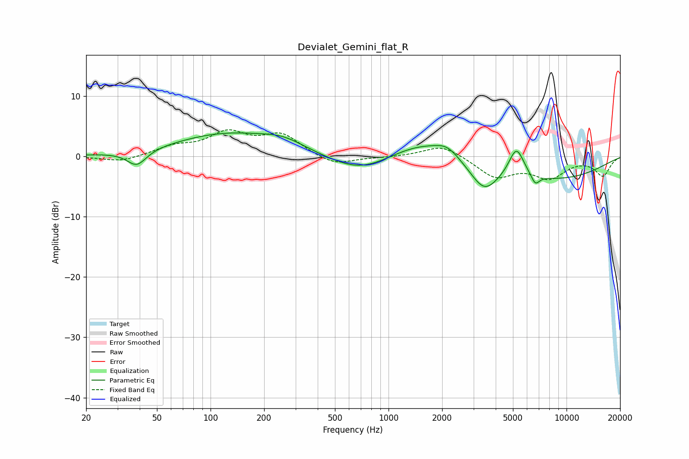

# Devialet_Gemini_flat_R
See [usage instructions](https://github.com/jaakkopasanen/AutoEq#usage) for more options and info.

### Parametric EQs
Apply preamp of -4.0 dB when using parametric equalizer.

|   # | Type    |   Fc (Hz) |    Q |   Gain (dB) |
|-----|---------|-----------|------|-------------|
|   1 | Peaking |        39 | 2.64 |        -2.6 |
|   2 | Peaking |       124 | 0.47 |         3.7 |
|   3 | Peaking |       256 | 1.21 |         1.4 |
|   4 | Peaking |       690 | 0.84 |        -2.9 |
|   5 | Peaking |      1533 | 0.79 |         2.7 |
|   6 | Peaking |      2132 | 2.11 |         1.6 |
|   7 | Peaking |      3450 | 1.77 |        -4.5 |
|   8 | Peaking |      5231 | 3.25 |         4.9 |
|   9 | Peaking |      6674 | 5.72 |        -1.7 |
|  10 | Peaking |      8396 | 0.41 |        -3.7 |

### Fixed Band EQs
When using fixed band (also called graphic) equalizer, apply preamp of **-4.5 dB** (if available) and set gains manually with these parameters.

|   # | Type    |   Fc (Hz) |    Q |   Gain (dB) |
|-----|---------|-----------|------|-------------|
|   1 | Peaking |        31 | 1.41 |        -1   |
|   2 | Peaking |        62 | 1.41 |         1.5 |
|   3 | Peaking |       125 | 1.41 |         3.6 |
|   4 | Peaking |       250 | 1.41 |         3.4 |
|   5 | Peaking |       500 | 1.41 |        -1.6 |
|   6 | Peaking |      1000 | 1.41 |        -0.1 |
|   7 | Peaking |      2000 | 1.41 |         2   |
|   8 | Peaking |      4000 | 1.41 |        -3.3 |
|   9 | Peaking |      8000 | 1.41 |        -3.3 |
|  10 | Peaking |     16000 | 1.41 |        -3.1 |

### Graphs

