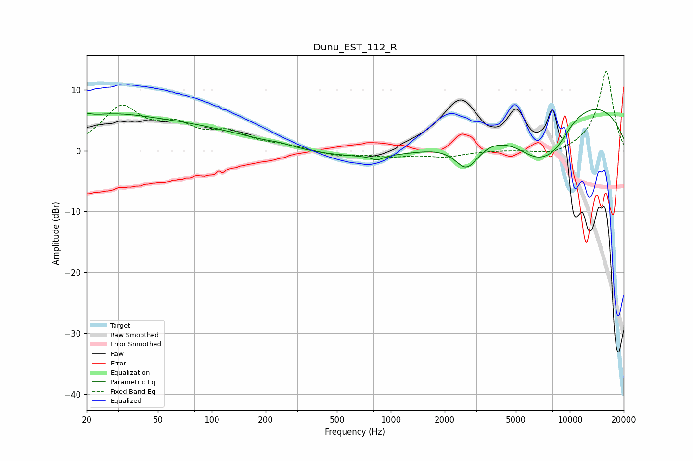

# Dunu_EST_112_R
See [usage instructions](https://github.com/jaakkopasanen/AutoEq#usage) for more options and info.

### Parametric EQs
Apply preamp of -6.8 dB when using parametric equalizer.

|   # | Type    |   Fc (Hz) |    Q |   Gain (dB) |
|-----|---------|-----------|------|-------------|
|   1 | Peaking |        20 | 5.69 |         0.6 |
|   2 | Peaking |        25 | 0.7  |         1.5 |
|   3 | Peaking |        40 | 0.24 |         4.7 |
|   4 | Peaking |       243 | 2.46 |         0.3 |
|   5 | Peaking |       838 | 4.4  |        -0.7 |
|   6 | Peaking |      2534 | 0.23 |       -10.5 |
|   7 | Peaking |      2656 | 2.07 |        -4.7 |
|   8 | Peaking |      5437 | 0.18 |        15.8 |
|   9 | Peaking |      6671 | 0.95 |        -7.6 |
|  10 | Peaking |      8446 | 1.65 |        -2.3 |

### Fixed Band EQs
When using fixed band (also called graphic) equalizer, apply preamp of **-13.1 dB** (if available) and set gains manually with these parameters.

|   # | Type    |   Fc (Hz) |    Q |   Gain (dB) |
|-----|---------|-----------|------|-------------|
|   1 | Peaking |        31 | 1.41 |         6.7 |
|   2 | Peaking |        62 | 1.41 |         3.3 |
|   3 | Peaking |       125 | 1.41 |         2.6 |
|   4 | Peaking |       250 | 1.41 |         0.7 |
|   5 | Peaking |       500 | 1.41 |        -0.8 |
|   6 | Peaking |      1000 | 1.41 |        -0.8 |
|   7 | Peaking |      2000 | 1.41 |        -0.9 |
|   8 | Peaking |      4000 | 1.41 |         0.1 |
|   9 | Peaking |      8000 | 1.41 |        -0.9 |
|  10 | Peaking |     16000 | 1.41 |        13.2 |

### Graphs

