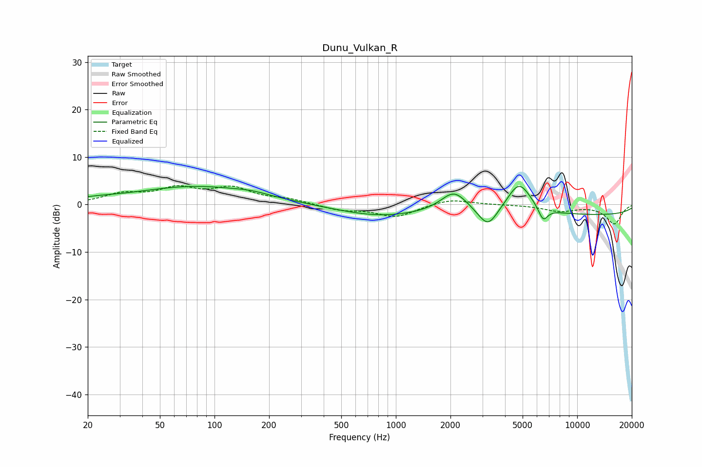

# Dunu_Vulkan_R
See [usage instructions](https://github.com/jaakkopasanen/AutoEq#usage) for more options and info.

### Parametric EQs
Apply preamp of -3.9 dB when using parametric equalizer.

|   # | Type    |   Fc (Hz) |    Q |   Gain (dB) |
|-----|---------|-----------|------|-------------|
|   1 | Peaking |        21 | 1.14 |         0.6 |
|   2 | Peaking |        36 | 5.95 |         0   |
|   3 | Peaking |        79 | 0.42 |         3.8 |
|   4 | Peaking |       160 | 1.56 |         0.5 |
|   5 | Peaking |       815 | 0.59 |        -2.3 |
|   6 | Peaking |      2095 | 1.91 |         4.4 |
|   7 | Peaking |      3221 | 2.62 |        -4.4 |
|   8 | Peaking |      4783 | 2.03 |         6.6 |
|   9 | Peaking |      6487 | 5.21 |        -2.9 |
|  10 | Peaking |     10000 | 0.18 |        -2.3 |

### Fixed Band EQs
When using fixed band (also called graphic) equalizer, apply preamp of **-4.1 dB** (if available) and set gains manually with these parameters.

|   # | Type    |   Fc (Hz) |    Q |   Gain (dB) |
|-----|---------|-----------|------|-------------|
|   1 | Peaking |        31 | 1.41 |         2   |
|   2 | Peaking |        62 | 1.41 |         3   |
|   3 | Peaking |       125 | 1.41 |         3.1 |
|   4 | Peaking |       250 | 1.41 |         1   |
|   5 | Peaking |       500 | 1.41 |        -1.1 |
|   6 | Peaking |      1000 | 1.41 |        -2.6 |
|   7 | Peaking |      2000 | 1.41 |         1.2 |
|   8 | Peaking |      4000 | 1.41 |        -0   |
|   9 | Peaking |      8000 | 1.41 |        -1.3 |
|  10 | Peaking |     16000 | 1.41 |        -4   |

### Graphs

