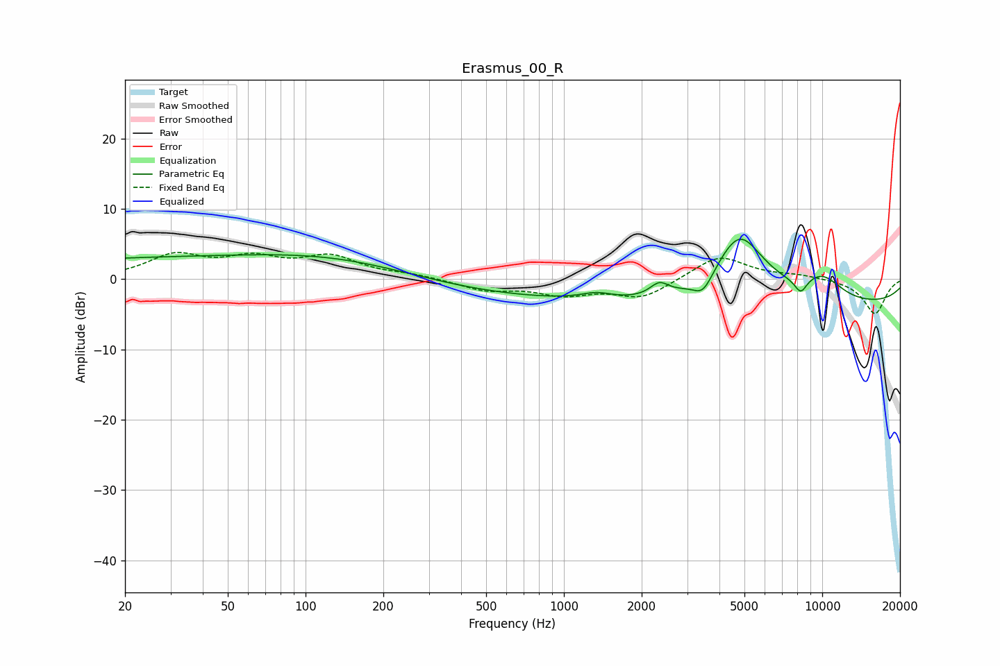

# Erasmus_00_R
See [usage instructions](https://github.com/jaakkopasanen/AutoEq#usage) for more options and info.

### Parametric EQs
Apply preamp of -5.8 dB when using parametric equalizer.

|   # | Type    |   Fc (Hz) |    Q |   Gain (dB) |
|-----|---------|-----------|------|-------------|
|   1 | Peaking |        31 | 0.18 |         3   |
|   2 | Peaking |       162 | 0.44 |         1.8 |
|   3 | Peaking |       892 | 0.24 |        -2.7 |
|   4 | Peaking |      1340 | 2.26 |         1   |
|   5 | Peaking |      2340 | 3.92 |         1.8 |
|   6 | Peaking |      3458 | 3.63 |        -2.6 |
|   7 | Peaking |      4778 | 1.35 |        10   |
|   8 | Peaking |      8256 | 5.37 |        -2.1 |
|   9 | Peaking |     10000 | 0.18 |        -3.8 |
|  10 | Peaking |     10000 | 1.51 |         3.3 |

### Fixed Band EQs
When using fixed band (also called graphic) equalizer, apply preamp of **-3.9 dB** (if available) and set gains manually with these parameters.

|   # | Type    |   Fc (Hz) |    Q |   Gain (dB) |
|-----|---------|-----------|------|-------------|
|   1 | Peaking |        31 | 1.41 |         3.2 |
|   2 | Peaking |        62 | 1.41 |         2.6 |
|   3 | Peaking |       125 | 1.41 |         2.9 |
|   4 | Peaking |       250 | 1.41 |         0.5 |
|   5 | Peaking |       500 | 1.41 |        -1.5 |
|   6 | Peaking |      1000 | 1.41 |        -2   |
|   7 | Peaking |      2000 | 1.41 |        -2.6 |
|   8 | Peaking |      4000 | 1.41 |         3.4 |
|   9 | Peaking |      8000 | 1.41 |         0.5 |
|  10 | Peaking |     16000 | 1.41 |        -5   |

### Graphs

