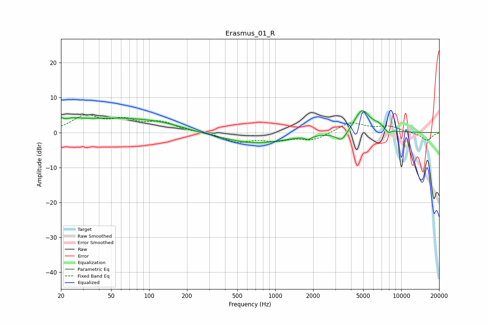

# Erasmus_01_R
See [usage instructions](https://github.com/jaakkopasanen/AutoEq#usage) for more options and info.

### Parametric EQs
Apply preamp of -6.3 dB when using parametric equalizer.

|   # | Type    |   Fc (Hz) |    Q |   Gain (dB) |
|-----|---------|-----------|------|-------------|
|   1 | Peaking |        20 | 1.56 |         4   |
|   2 | Peaking |        22 | 3.5  |        -1.8 |
|   3 | Peaking |        58 | 0.4  |         3.9 |
|   4 | Peaking |       133 | 1.05 |         0.7 |
|   5 | Peaking |       687 | 0.56 |        -3.1 |
|   6 | Peaking |      1830 | 5.95 |        -0.9 |
|   7 | Peaking |      3370 | 3.11 |        -3   |
|   8 | Peaking |      4880 | 2.26 |         6.6 |
|   9 | Peaking |      6575 | 2.94 |         1.3 |
|  10 | Peaking |      7876 | 5.92 |        -1.2 |

### Fixed Band EQs
When using fixed band (also called graphic) equalizer, apply preamp of **-5.2 dB** (if available) and set gains manually with these parameters.

|   # | Type    |   Fc (Hz) |    Q |   Gain (dB) |
|-----|---------|-----------|------|-------------|
|   1 | Peaking |        31 | 1.41 |         4.5 |
|   2 | Peaking |        62 | 1.41 |         3.1 |
|   3 | Peaking |       125 | 1.41 |         2.7 |
|   4 | Peaking |       250 | 1.41 |         0.1 |
|   5 | Peaking |       500 | 1.41 |        -2.6 |
|   6 | Peaking |      1000 | 1.41 |        -1.9 |
|   7 | Peaking |      2000 | 1.41 |        -2.1 |
|   8 | Peaking |      4000 | 1.41 |         3   |
|   9 | Peaking |      8000 | 1.41 |         1.6 |
|  10 | Peaking |     16000 | 1.41 |        -2.3 |

### Graphs

