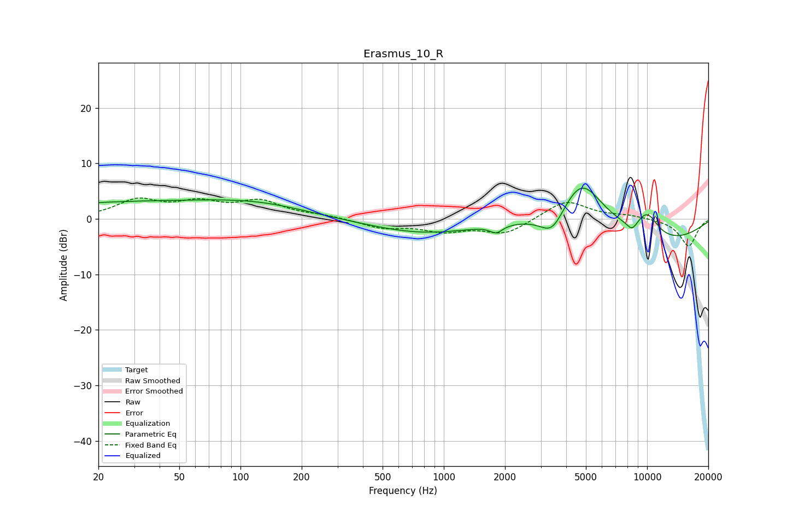

# Erasmus_10_R
See [usage instructions](https://github.com/jaakkopasanen/AutoEq#usage) for more options and info.

### Parametric EQs
Apply preamp of -5.6 dB when using parametric equalizer.

|   # | Type    |   Fc (Hz) |    Q |   Gain (dB) |
|-----|---------|-----------|------|-------------|
|   1 | Peaking |        27 | 0.27 |         2.9 |
|   2 | Peaking |        59 | 1.46 |         0   |
|   3 | Peaking |       125 | 0.56 |         2   |
|   4 | Peaking |       795 | 0.53 |        -2.6 |
|   5 | Peaking |      1812 | 4.61 |        -1.3 |
|   6 | Peaking |      3416 | 2.25 |        -4.6 |
|   7 | Peaking |      4749 | 1.19 |        10   |
|   8 | Peaking |      8438 | 4.89 |        -1.6 |
|   9 | Peaking |      9904 | 0.35 |        -4.8 |
|  10 | Peaking |     10000 | 2.14 |         4.3 |

### Fixed Band EQs
When using fixed band (also called graphic) equalizer, apply preamp of **-3.9 dB** (if available) and set gains manually with these parameters.

|   # | Type    |   Fc (Hz) |    Q |   Gain (dB) |
|-----|---------|-----------|------|-------------|
|   1 | Peaking |        31 | 1.41 |         3.2 |
|   2 | Peaking |        62 | 1.41 |         2.5 |
|   3 | Peaking |       125 | 1.41 |         2.9 |
|   4 | Peaking |       250 | 1.41 |         0.5 |
|   5 | Peaking |       500 | 1.41 |        -1.5 |
|   6 | Peaking |      1000 | 1.41 |        -1.9 |
|   7 | Peaking |      2000 | 1.41 |        -2.7 |
|   8 | Peaking |      4000 | 1.41 |         3.4 |
|   9 | Peaking |      8000 | 1.41 |         0.6 |
|  10 | Peaking |     16000 | 1.41 |        -4.9 |

### Graphs

