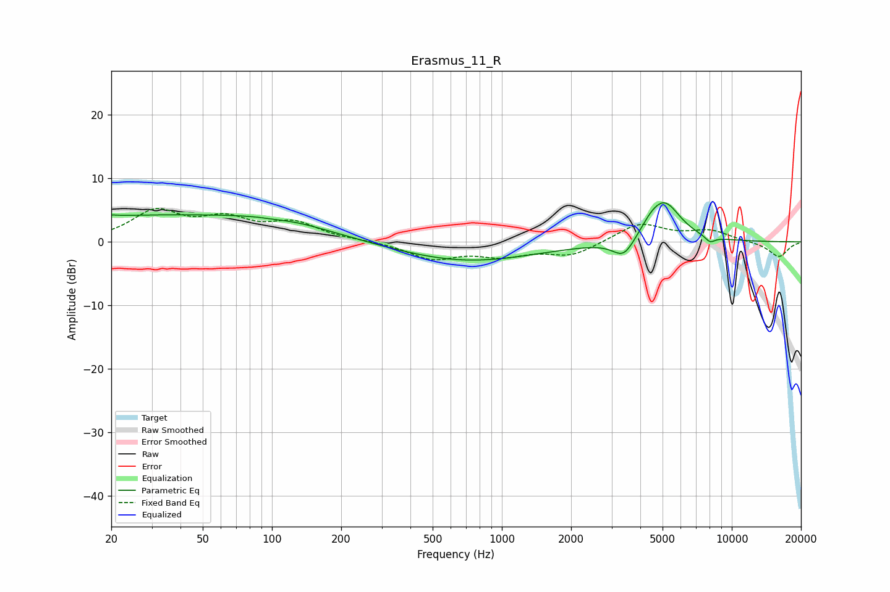

# Erasmus_11_R
See [usage instructions](https://github.com/jaakkopasanen/AutoEq#usage) for more options and info.

### Parametric EQs
Apply preamp of -6.2 dB when using parametric equalizer.

|   # | Type    |   Fc (Hz) |    Q |   Gain (dB) |
|-----|---------|-----------|------|-------------|
|   1 | Peaking |        20 | 5.94 |         3.2 |
|   2 | Peaking |        20 | 5.96 |        -3   |
|   3 | Peaking |        32 | 0.21 |         4.1 |
|   4 | Peaking |       103 | 2.47 |        -0.2 |
|   5 | Peaking |       113 | 0.76 |         1   |
|   6 | Peaking |       699 | 0.47 |        -3.1 |
|   7 | Peaking |      3392 | 2.93 |        -3   |
|   8 | Peaking |      4442 | 3.02 |         1.2 |
|   9 | Peaking |      5105 | 1.95 |         6.1 |
|  10 | Peaking |      8040 | 5.92 |        -1   |

### Fixed Band EQs
When using fixed band (also called graphic) equalizer, apply preamp of **-5.4 dB** (if available) and set gains manually with these parameters.

|   # | Type    |   Fc (Hz) |    Q |   Gain (dB) |
|-----|---------|-----------|------|-------------|
|   1 | Peaking |        31 | 1.41 |         4.6 |
|   2 | Peaking |        62 | 1.41 |         3.1 |
|   3 | Peaking |       125 | 1.41 |         2.7 |
|   4 | Peaking |       250 | 1.41 |         0.1 |
|   5 | Peaking |       500 | 1.41 |        -2.6 |
|   6 | Peaking |      1000 | 1.41 |        -1.9 |
|   7 | Peaking |      2000 | 1.41 |        -2.1 |
|   8 | Peaking |      4000 | 1.41 |         3   |
|   9 | Peaking |      8000 | 1.41 |         1.7 |
|  10 | Peaking |     16000 | 1.41 |        -2.4 |

### Graphs

