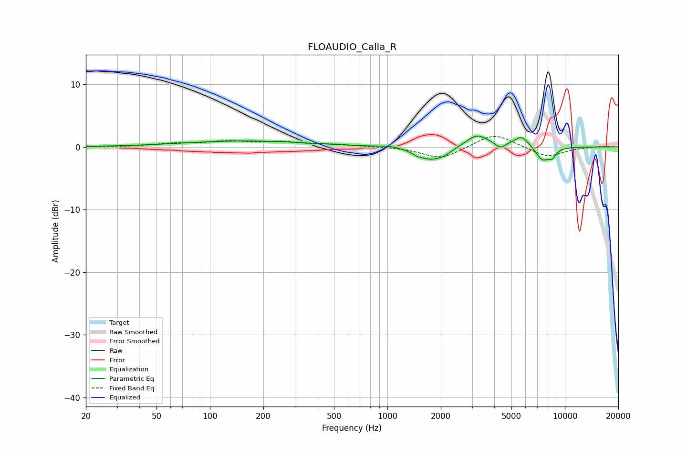

# FLOAUDIO_Calla_R
See [usage instructions](https://github.com/jaakkopasanen/AutoEq#usage) for more options and info.

### Parametric EQs
Apply preamp of -1.8 dB when using parametric equalizer.

|   # | Type    |   Fc (Hz) |    Q |   Gain (dB) |
|-----|---------|-----------|------|-------------|
|   1 | Peaking |       161 | 0.39 |         0.9 |
|   2 | Peaking |      1029 | 2.54 |         0.2 |
|   3 | Peaking |      1463 | 4.71 |        -0.4 |
|   4 | Peaking |      1758 | 2.01 |        -1.9 |
|   5 | Peaking |      2108 | 3.56 |        -0.6 |
|   6 | Peaking |      3206 | 2.31 |         2   |
|   7 | Peaking |      4324 | 5.92 |        -0.8 |
|   8 | Peaking |      5709 | 3.23 |         1.8 |
|   9 | Peaking |      7467 | 3.53 |        -2.2 |
|  10 | Peaking |      8491 | 5.99 |        -1.2 |

### Fixed Band EQs
When using fixed band (also called graphic) equalizer, apply preamp of **-1.8 dB** (if available) and set gains manually with these parameters.

|   # | Type    |   Fc (Hz) |    Q |   Gain (dB) |
|-----|---------|-----------|------|-------------|
|   1 | Peaking |        31 | 1.41 |        -0   |
|   2 | Peaking |        62 | 1.41 |         0.5 |
|   3 | Peaking |       125 | 1.41 |         0.8 |
|   4 | Peaking |       250 | 1.41 |         0.7 |
|   5 | Peaking |       500 | 1.41 |         0.4 |
|   6 | Peaking |      1000 | 1.41 |         0.1 |
|   7 | Peaking |      2000 | 1.41 |        -2   |
|   8 | Peaking |      4000 | 1.41 |         2.2 |
|   9 | Peaking |      8000 | 1.41 |        -1.6 |
|  10 | Peaking |     16000 | 1.41 |         0.1 |

### Graphs

