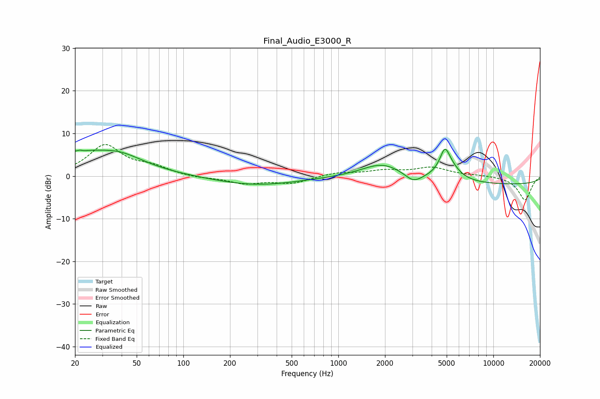

# Final_Audio_E3000_R
See [usage instructions](https://github.com/jaakkopasanen/AutoEq#usage) for more options and info.

### Parametric EQs
Apply preamp of -6.4 dB when using parametric equalizer.

|   # | Type    |   Fc (Hz) |    Q |   Gain (dB) |
|-----|---------|-----------|------|-------------|
|   1 | Peaking |        22 | 0.46 |         5.3 |
|   2 | Peaking |        22 | 5.83 |         3.1 |
|   3 | Peaking |        22 | 5.99 |        -3   |
|   4 | Peaking |        40 | 1.08 |         1.8 |
|   5 | Peaking |       297 | 0.52 |        -2.1 |
|   6 | Peaking |      1934 | 1.04 |         3.6 |
|   7 | Peaking |      3048 | 2.65 |        -2   |
|   8 | Peaking |      4864 | 4.76 |         4.1 |
|   9 | Peaking |      5089 | 2.09 |         3.8 |
|  10 | Peaking |     10000 | 0.18 |        -2   |

### Fixed Band EQs
When using fixed band (also called graphic) equalizer, apply preamp of **-7.5 dB** (if available) and set gains manually with these parameters.

|   # | Type    |   Fc (Hz) |    Q |   Gain (dB) |
|-----|---------|-----------|------|-------------|
|   1 | Peaking |        31 | 1.41 |         7.1 |
|   2 | Peaking |        62 | 1.41 |         1.8 |
|   3 | Peaking |       125 | 1.41 |        -0.5 |
|   4 | Peaking |       250 | 1.41 |        -1.7 |
|   5 | Peaking |       500 | 1.41 |        -1.6 |
|   6 | Peaking |      1000 | 1.41 |         0.8 |
|   7 | Peaking |      2000 | 1.41 |         1.2 |
|   8 | Peaking |      4000 | 1.41 |         1.9 |
|   9 | Peaking |      8000 | 1.41 |         0.2 |
|  10 | Peaking |     16000 | 1.41 |        -5.6 |

### Graphs

