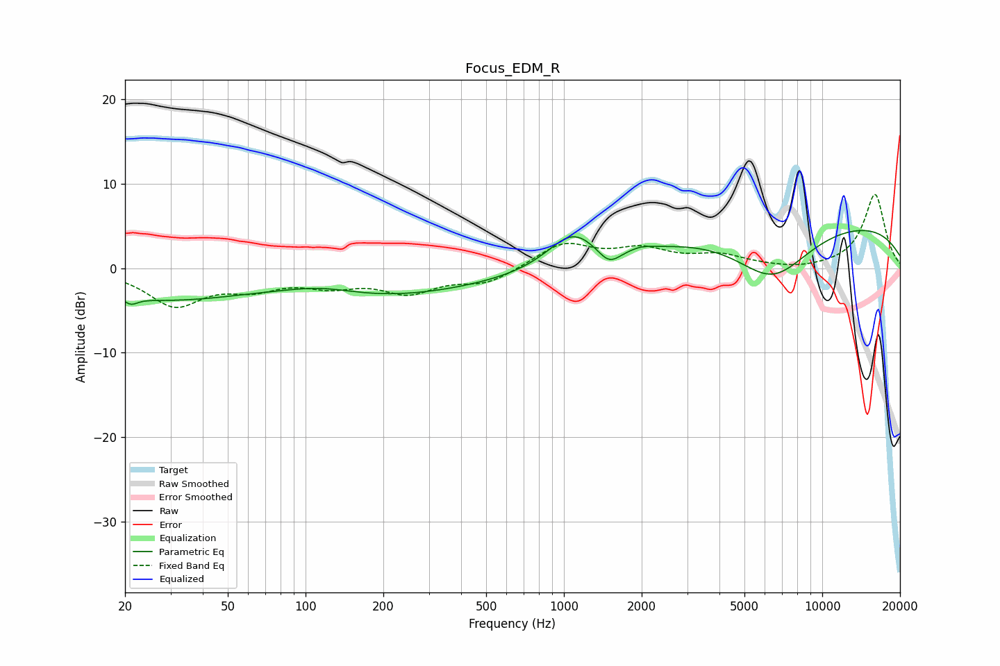

# Focus_EDM_R
See [usage instructions](https://github.com/jaakkopasanen/AutoEq#usage) for more options and info.

### Parametric EQs
Apply preamp of -4.6 dB when using parametric equalizer.

|   # | Type    |   Fc (Hz) |    Q |   Gain (dB) |
|-----|---------|-----------|------|-------------|
|   1 | Peaking |        21 | 5.63 |        -0.8 |
|   2 | Peaking |        28 | 0.42 |        -3.5 |
|   3 | Peaking |       115 | 1.12 |         0.8 |
|   4 | Peaking |       193 | 0.45 |        -2.1 |
|   5 | Peaking |       530 | 0.25 |        -1.3 |
|   6 | Peaking |      1080 | 1.45 |         4.2 |
|   7 | Peaking |      1496 | 3.08 |        -2.1 |
|   8 | Peaking |      1995 | 2.92 |         0.4 |
|   9 | Peaking |      6408 | 0.92 |        -6.4 |
|  10 | Peaking |      8790 | 0.19 |         5.9 |

### Fixed Band EQs
When using fixed band (also called graphic) equalizer, apply preamp of **-8.8 dB** (if available) and set gains manually with these parameters.

|   # | Type    |   Fc (Hz) |    Q |   Gain (dB) |
|-----|---------|-----------|------|-------------|
|   1 | Peaking |        31 | 1.41 |        -4.2 |
|   2 | Peaking |        62 | 1.41 |        -1.9 |
|   3 | Peaking |       125 | 1.41 |        -1.7 |
|   4 | Peaking |       250 | 1.41 |        -2.6 |
|   5 | Peaking |       500 | 1.41 |        -1.7 |
|   6 | Peaking |      1000 | 1.41 |         2.9 |
|   7 | Peaking |      2000 | 1.41 |         2   |
|   8 | Peaking |      4000 | 1.41 |         1.3 |
|   9 | Peaking |      8000 | 1.41 |        -0.3 |
|  10 | Peaking |     16000 | 1.41 |         8.8 |

### Graphs

