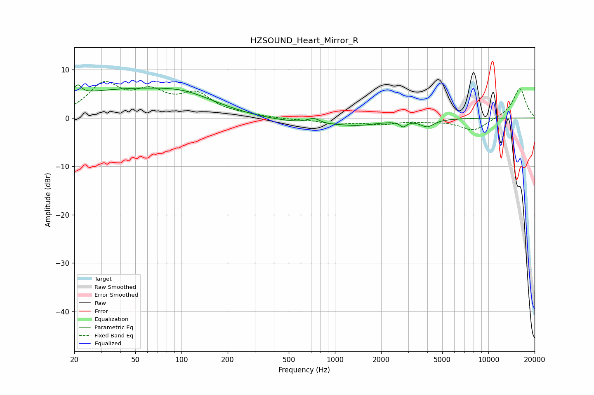

# HZSOUND_Heart_Mirror_R
See [usage instructions](https://github.com/jaakkopasanen/AutoEq#usage) for more options and info.

### Parametric EQs
Apply preamp of -6.9 dB when using parametric equalizer.

|   # | Type    |   Fc (Hz) |    Q |   Gain (dB) |
|-----|---------|-----------|------|-------------|
|   1 | Peaking |        21 | 5.93 |         2.1 |
|   2 | Peaking |        50 | 0.26 |         6   |
|   3 | Peaking |       105 | 0.83 |         1.4 |
|   4 | Peaking |       386 | 0.2  |        -1.4 |
|   5 | Peaking |       729 | 3.06 |         1.7 |
|   6 | Peaking |       746 | 1.89 |        -0.8 |
|   7 | Peaking |      1424 | 1.32 |        -0.6 |
|   8 | Peaking |      2798 | 5.99 |        -1.8 |
|   9 | Peaking |      2824 | 4.81 |         0.7 |
|  10 | Peaking |      3993 | 3.25 |        -1.5 |

### Fixed Band EQs
When using fixed band (also called graphic) equalizer, apply preamp of **-7.6 dB** (if available) and set gains manually with these parameters.

|   # | Type    |   Fc (Hz) |    Q |   Gain (dB) |
|-----|---------|-----------|------|-------------|
|   1 | Peaking |        31 | 1.41 |         6.5 |
|   2 | Peaking |        62 | 1.41 |         4.4 |
|   3 | Peaking |       125 | 1.41 |         4.4 |
|   4 | Peaking |       250 | 1.41 |         0.4 |
|   5 | Peaking |       500 | 1.41 |        -0.3 |
|   6 | Peaking |      1000 | 1.41 |        -1.1 |
|   7 | Peaking |      2000 | 1.41 |        -1.1 |
|   8 | Peaking |      4000 | 1.41 |        -0.5 |
|   9 | Peaking |      8000 | 1.41 |        -2.6 |
|  10 | Peaking |     16000 | 1.41 |         6.2 |

### Graphs

