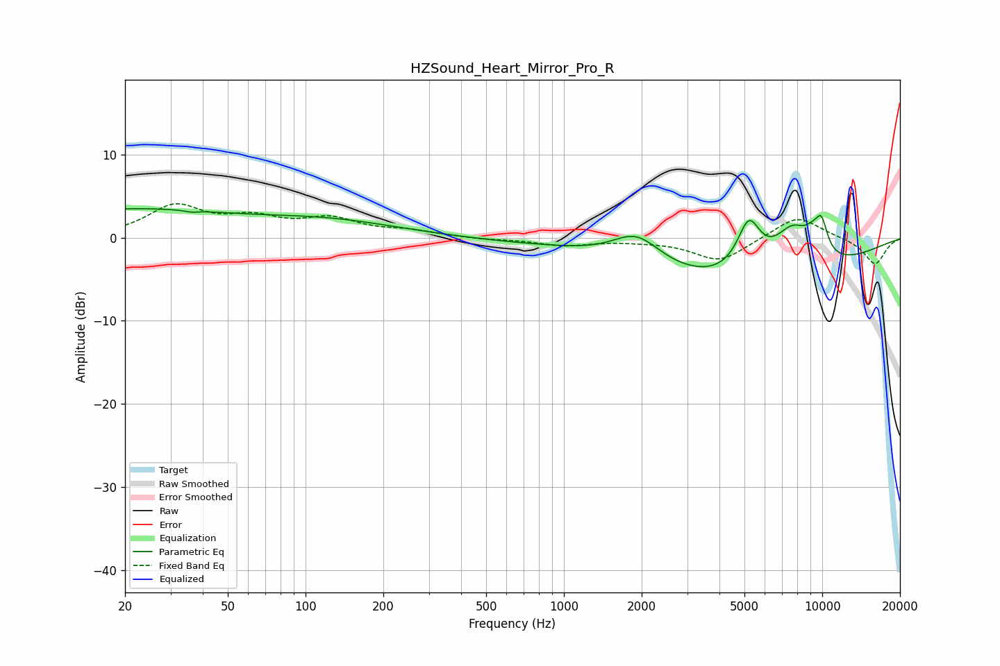

# HZSound_Heart_Mirror_Pro_R
See [usage instructions](https://github.com/jaakkopasanen/AutoEq#usage) for more options and info.

### Parametric EQs
Apply preamp of -3.6 dB when using parametric equalizer.

|   # | Type    |   Fc (Hz) |    Q |   Gain (dB) |
|-----|---------|-----------|------|-------------|
|   1 | Peaking |        20 | 0.34 |         3.3 |
|   2 | Peaking |        36 | 5.85 |        -0.2 |
|   3 | Peaking |       122 | 0.52 |         1.8 |
|   4 | Peaking |       590 | 0.72 |        -0.2 |
|   5 | Peaking |      1911 | 1.49 |         3.5 |
|   6 | Peaking |      5182 | 0.32 |        -6   |
|   7 | Peaking |      5199 | 2.98 |         6   |
|   8 | Peaking |      7680 | 1.67 |         5.6 |
|   9 | Peaking |      9148 | 4.42 |         1.3 |
|  10 | Peaking |      9926 | 4.99 |         3.8 |

### Fixed Band EQs
When using fixed band (also called graphic) equalizer, apply preamp of **-4.2 dB** (if available) and set gains manually with these parameters.

|   # | Type    |   Fc (Hz) |    Q |   Gain (dB) |
|-----|---------|-----------|------|-------------|
|   1 | Peaking |        31 | 1.41 |         3.6 |
|   2 | Peaking |        62 | 1.41 |         2   |
|   3 | Peaking |       125 | 1.41 |         2   |
|   4 | Peaking |       250 | 1.41 |         0.7 |
|   5 | Peaking |       500 | 1.41 |        -0.2 |
|   6 | Peaking |      1000 | 1.41 |        -0.9 |
|   7 | Peaking |      2000 | 1.41 |        -0.2 |
|   8 | Peaking |      4000 | 1.41 |        -2.8 |
|   9 | Peaking |      8000 | 1.41 |         2.7 |
|  10 | Peaking |     16000 | 1.41 |        -3.2 |

### Graphs

