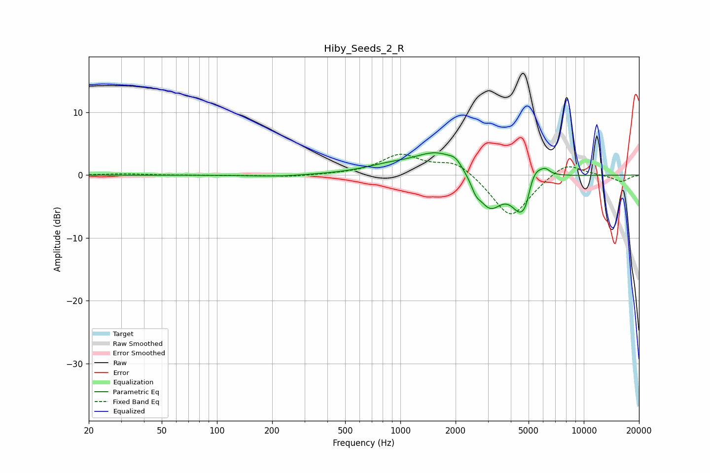

# Hiby_Seeds_2_R
See [usage instructions](https://github.com/jaakkopasanen/AutoEq#usage) for more options and info.

### Parametric EQs
Apply preamp of -3.7 dB when using parametric equalizer.

|   # | Type    |   Fc (Hz) |    Q |   Gain (dB) |
|-----|---------|-----------|------|-------------|
|   1 | Peaking |       212 | 1.09 |        -0.3 |
|   2 | Peaking |       857 | 1    |         1.1 |
|   3 | Peaking |      1616 | 1.1  |         3.7 |
|   4 | Peaking |      2003 | 4.21 |         1.1 |
|   5 | Peaking |      2581 | 5.96 |        -1.3 |
|   6 | Peaking |      3065 | 2.03 |        -5.6 |
|   7 | Peaking |      4537 | 2.66 |        -6.2 |
|   8 | Peaking |      4852 | 5.96 |        -1.8 |
|   9 | Peaking |      5298 | 2.52 |         4   |
|  10 | Peaking |      6190 | 6    |         0.7 |

### Fixed Band EQs
When using fixed band (also called graphic) equalizer, apply preamp of **-3.4 dB** (if available) and set gains manually with these parameters.

|   # | Type    |   Fc (Hz) |    Q |   Gain (dB) |
|-----|---------|-----------|------|-------------|
|   1 | Peaking |        31 | 1.41 |         0.2 |
|   2 | Peaking |        62 | 1.41 |        -0   |
|   3 | Peaking |       125 | 1.41 |        -0   |
|   4 | Peaking |       250 | 1.41 |        -0.3 |
|   5 | Peaking |       500 | 1.41 |         0.1 |
|   6 | Peaking |      1000 | 1.41 |         3.1 |
|   7 | Peaking |      2000 | 1.41 |         2.3 |
|   8 | Peaking |      4000 | 1.41 |        -7   |
|   9 | Peaking |      8000 | 1.41 |         2.3 |
|  10 | Peaking |     16000 | 1.41 |        -1.1 |

### Graphs

