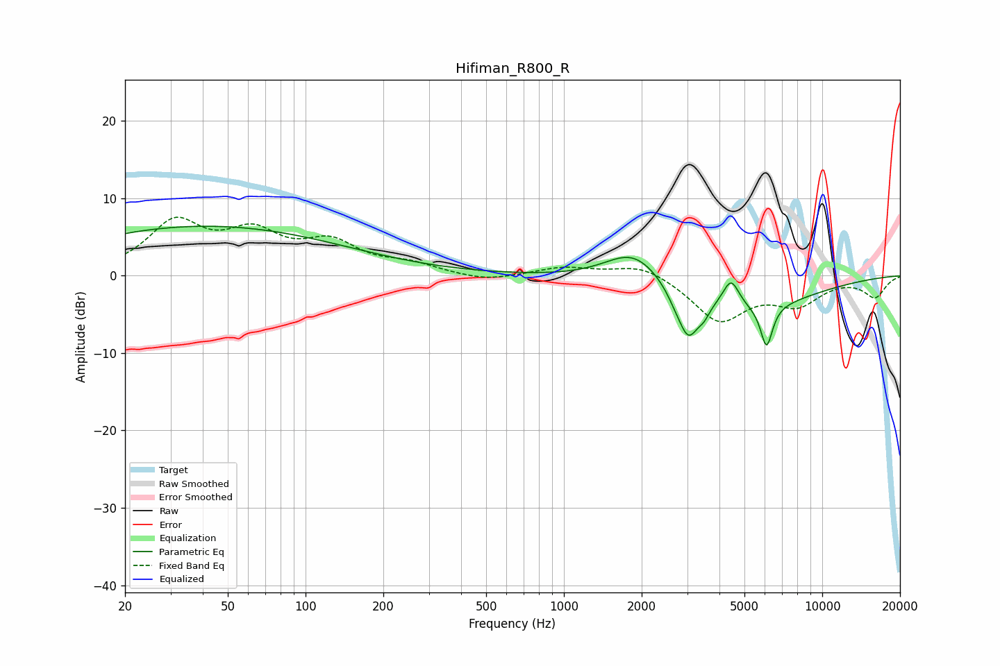

# Hifiman_R800_R
See [usage instructions](https://github.com/jaakkopasanen/AutoEq#usage) for more options and info.

### Parametric EQs
Apply preamp of -6.5 dB when using parametric equalizer.

|   # | Type    |   Fc (Hz) |    Q |   Gain (dB) |
|-----|---------|-----------|------|-------------|
|   1 | Peaking |        41 | 0.26 |         6.4 |
|   2 | Peaking |      1879 | 1.2  |         5.1 |
|   3 | Peaking |      2206 | 4.29 |         0.1 |
|   4 | Peaking |      2692 | 5.06 |        -0.6 |
|   5 | Peaking |      3026 | 3.64 |        -5.4 |
|   6 | Peaking |      3479 | 5.95 |        -1.2 |
|   7 | Peaking |      4143 | 1.07 |         2.4 |
|   8 | Peaking |      4233 | 0.55 |        -6.5 |
|   9 | Peaking |      4437 | 4.48 |         3.4 |
|  10 | Peaking |      6089 | 5.94 |        -5.4 |

### Fixed Band EQs
When using fixed band (also called graphic) equalizer, apply preamp of **-7.6 dB** (if available) and set gains manually with these parameters.

|   # | Type    |   Fc (Hz) |    Q |   Gain (dB) |
|-----|---------|-----------|------|-------------|
|   1 | Peaking |        31 | 1.41 |         6.5 |
|   2 | Peaking |        62 | 1.41 |         4.7 |
|   3 | Peaking |       125 | 1.41 |         3.7 |
|   4 | Peaking |       250 | 1.41 |         1.2 |
|   5 | Peaking |       500 | 1.41 |        -0.8 |
|   6 | Peaking |      1000 | 1.41 |         1.1 |
|   7 | Peaking |      2000 | 1.41 |         1.6 |
|   8 | Peaking |      4000 | 1.41 |        -5.7 |
|   9 | Peaking |      8000 | 1.41 |        -3.3 |
|  10 | Peaking |     16000 | 1.41 |        -2.7 |

### Graphs

