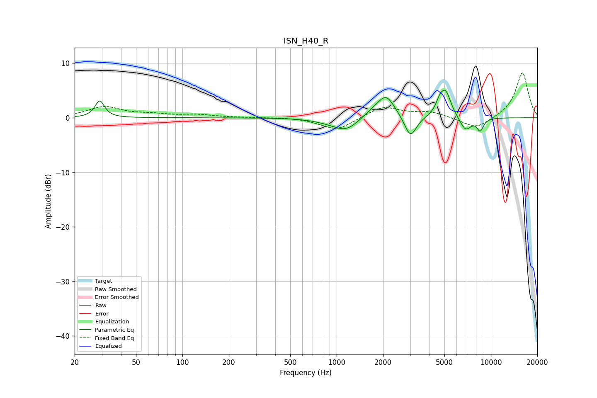

# ISN_H40_R
See [usage instructions](https://github.com/jaakkopasanen/AutoEq#usage) for more options and info.

### Parametric EQs
Apply preamp of -5.2 dB when using parametric equalizer.

|   # | Type    |   Fc (Hz) |    Q |   Gain (dB) |
|-----|---------|-----------|------|-------------|
|   1 | Peaking |        29 | 4.88 |         3.1 |
|   2 | Peaking |       920 | 1.28 |        -0.4 |
|   3 | Peaking |      1156 | 1.7  |        -2.3 |
|   4 | Peaking |      1774 | 1.71 |         1.3 |
|   5 | Peaking |      2104 | 2.61 |         3.5 |
|   6 | Peaking |      3010 | 3.69 |        -4   |
|   7 | Peaking |      4654 | 5.43 |         1.7 |
|   8 | Peaking |      5092 | 3.94 |         4.6 |
|   9 | Peaking |      6851 | 3.64 |        -2.5 |
|  10 | Peaking |      8528 | 6    |        -2.2 |

### Fixed Band EQs
When using fixed band (also called graphic) equalizer, apply preamp of **-8.3 dB** (if available) and set gains manually with these parameters.

|   # | Type    |   Fc (Hz) |    Q |   Gain (dB) |
|-----|---------|-----------|------|-------------|
|   1 | Peaking |        31 | 1.41 |         1.9 |
|   2 | Peaking |        62 | 1.41 |         0.5 |
|   3 | Peaking |       125 | 1.41 |         0.5 |
|   4 | Peaking |       250 | 1.41 |         0   |
|   5 | Peaking |       500 | 1.41 |         0.1 |
|   6 | Peaking |      1000 | 1.41 |        -2.3 |
|   7 | Peaking |      2000 | 1.41 |         2.1 |
|   8 | Peaking |      4000 | 1.41 |         1   |
|   9 | Peaking |      8000 | 1.41 |        -2.1 |
|  10 | Peaking |     16000 | 1.41 |         8.3 |

### Graphs

