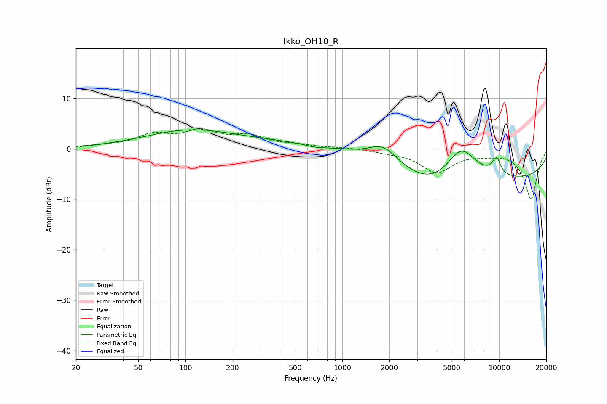

# Ikko_OH10_R
See [usage instructions](https://github.com/jaakkopasanen/AutoEq#usage) for more options and info.

### Parametric EQs
Apply preamp of -3.9 dB when using parametric equalizer.

|   # | Type    |   Fc (Hz) |    Q |   Gain (dB) |
|-----|---------|-----------|------|-------------|
|   1 | Peaking |       102 | 0.5  |         3.3 |
|   2 | Peaking |       438 | 0.32 |         1.2 |
|   3 | Peaking |       674 | 1.99 |        -0.5 |
|   4 | Peaking |      1819 | 1.57 |         3.4 |
|   5 | Peaking |      3869 | 0.81 |        -3.2 |
|   6 | Peaking |      5719 | 1.35 |         7.2 |
|   7 | Peaking |      9181 | 0.18 |        -6.2 |
|   8 | Peaking |      9685 | 4.1  |         4   |
|   9 | Peaking |      9987 | 5.84 |         0.5 |
|  10 | Peaking |     10000 | 4.4  |        -1.3 |

### Fixed Band EQs
When using fixed band (also called graphic) equalizer, apply preamp of **-4.1 dB** (if available) and set gains manually with these parameters.

|   # | Type    |   Fc (Hz) |    Q |   Gain (dB) |
|-----|---------|-----------|------|-------------|
|   1 | Peaking |        31 | 1.41 |         0.5 |
|   2 | Peaking |        62 | 1.41 |         2.5 |
|   3 | Peaking |       125 | 1.41 |         3.1 |
|   4 | Peaking |       250 | 1.41 |         2.3 |
|   5 | Peaking |       500 | 1.41 |         0.6 |
|   6 | Peaking |      1000 | 1.41 |         0.3 |
|   7 | Peaking |      2000 | 1.41 |        -0.5 |
|   8 | Peaking |      4000 | 1.41 |        -4.5 |
|   9 | Peaking |      8000 | 1.41 |        -0.7 |
|  10 | Peaking |     16000 | 1.41 |        -9.9 |

### Graphs

