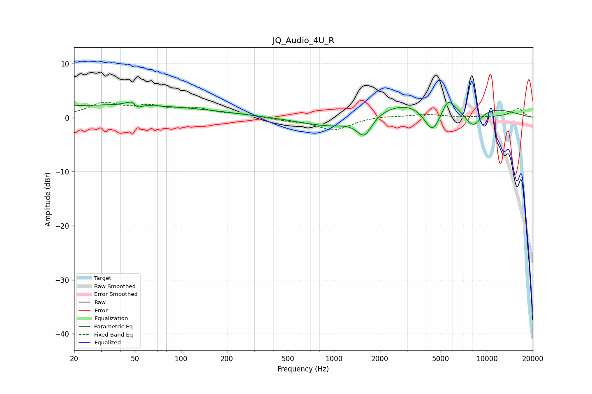

# JQ_Audio_4U_R
See [usage instructions](https://github.com/jaakkopasanen/AutoEq#usage) for more options and info.

### Parametric EQs
Apply preamp of -3.0 dB when using parametric equalizer.

|   # | Type    |   Fc (Hz) |    Q |   Gain (dB) |
|-----|---------|-----------|------|-------------|
|   1 | Peaking |        35 | 0.18 |         2.3 |
|   2 | Peaking |        49 | 3.78 |         2   |
|   3 | Peaking |        51 | 4.81 |        -1.9 |
|   4 | Peaking |       190 | 1.34 |         0   |
|   5 | Peaking |      1013 | 0.7  |        -2.7 |
|   6 | Peaking |      1584 | 2.78 |        -3.9 |
|   7 | Peaking |      4256 | 0.29 |         4.2 |
|   8 | Peaking |      4420 | 2.38 |        -5.7 |
|   9 | Peaking |      5565 | 3.81 |         2.2 |
|  10 | Peaking |      8105 | 2.05 |        -4.3 |

### Fixed Band EQs
When using fixed band (also called graphic) equalizer, apply preamp of **-3.0 dB** (if available) and set gains manually with these parameters.

|   # | Type    |   Fc (Hz) |    Q |   Gain (dB) |
|-----|---------|-----------|------|-------------|
|   1 | Peaking |        31 | 1.41 |         2.5 |
|   2 | Peaking |        62 | 1.41 |         1.8 |
|   3 | Peaking |       125 | 1.41 |         1.4 |
|   4 | Peaking |       250 | 1.41 |         0.5 |
|   5 | Peaking |       500 | 1.41 |        -0.4 |
|   6 | Peaking |      1000 | 1.41 |        -2.3 |
|   7 | Peaking |      2000 | 1.41 |         0.3 |
|   8 | Peaking |      4000 | 1.41 |         0.6 |
|   9 | Peaking |      8000 | 1.41 |         0.1 |
|  10 | Peaking |     16000 | 1.41 |         1.7 |

### Graphs

