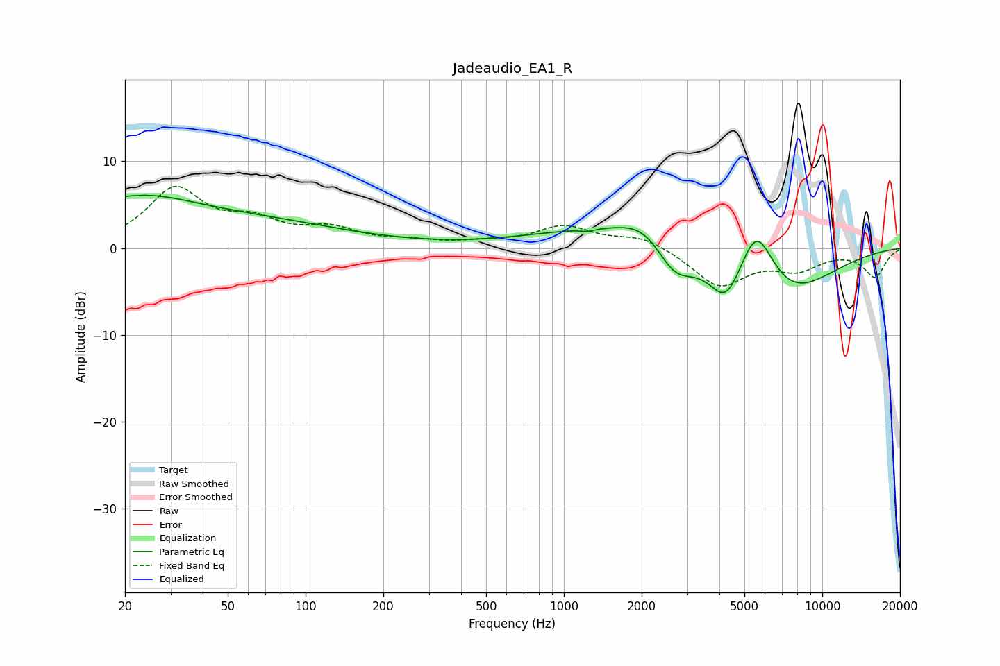

# Jadeaudio_EA1_R
See [usage instructions](https://github.com/jaakkopasanen/AutoEq#usage) for more options and info.

### Parametric EQs
Apply preamp of -6.2 dB when using parametric equalizer.

|   # | Type    |   Fc (Hz) |    Q |   Gain (dB) |
|-----|---------|-----------|------|-------------|
|   1 | Peaking |        20 | 5.17 |         0.2 |
|   2 | Peaking |        22 | 0.67 |         4.2 |
|   3 | Peaking |        58 | 0.37 |         2.9 |
|   4 | Peaking |      1230 | 0.55 |         1.8 |
|   5 | Peaking |      1231 | 5.81 |        -0.3 |
|   6 | Peaking |      2056 | 1.34 |         2.8 |
|   7 | Peaking |      2679 | 1.84 |        -4   |
|   8 | Peaking |      4238 | 2.2  |        -5   |
|   9 | Peaking |      5564 | 2.01 |         7.1 |
|  10 | Peaking |      7247 | 0.76 |        -5.6 |

### Fixed Band EQs
When using fixed band (also called graphic) equalizer, apply preamp of **-7.2 dB** (if available) and set gains manually with these parameters.

|   # | Type    |   Fc (Hz) |    Q |   Gain (dB) |
|-----|---------|-----------|------|-------------|
|   1 | Peaking |        31 | 1.41 |         6.6 |
|   2 | Peaking |        62 | 1.41 |         2.5 |
|   3 | Peaking |       125 | 1.41 |         1.9 |
|   4 | Peaking |       250 | 1.41 |         0.6 |
|   5 | Peaking |       500 | 1.41 |         0.5 |
|   6 | Peaking |      1000 | 1.41 |         2.4 |
|   7 | Peaking |      2000 | 1.41 |         1.4 |
|   8 | Peaking |      4000 | 1.41 |        -4.3 |
|   9 | Peaking |      8000 | 1.41 |        -2.1 |
|  10 | Peaking |     16000 | 1.41 |        -3.2 |

### Graphs

