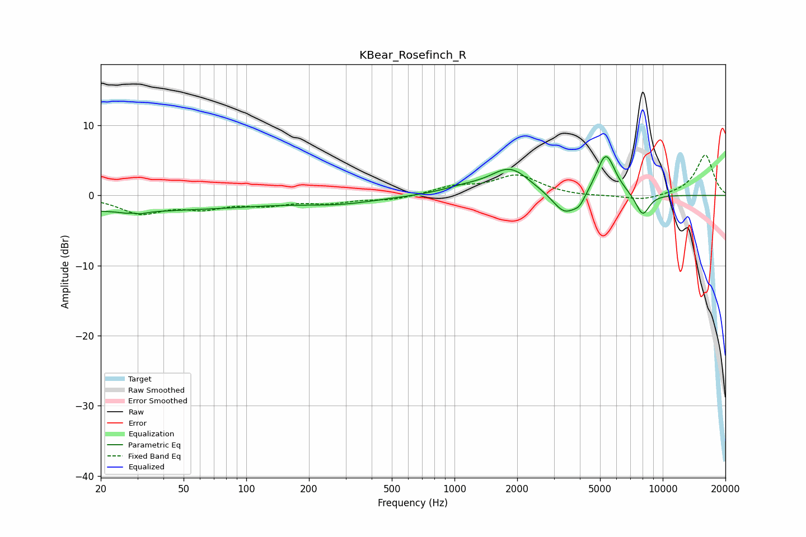

# KBear_Rosefinch_R
See [usage instructions](https://github.com/jaakkopasanen/AutoEq#usage) for more options and info.

### Parametric EQs
Apply preamp of -5.6 dB when using parametric equalizer.

|   # | Type    |   Fc (Hz) |    Q |   Gain (dB) |
|-----|---------|-----------|------|-------------|
|   1 | Peaking |        24 | 0.19 |        -2.2 |
|   2 | Peaking |        29 | 5.1  |         2   |
|   3 | Peaking |        29 | 4.34 |        -2.4 |
|   4 | Peaking |       280 | 0.75 |        -1   |
|   5 | Peaking |      1108 | 1.31 |         0.8 |
|   6 | Peaking |      1851 | 1.47 |         3.7 |
|   7 | Peaking |      3389 | 2.31 |        -3.3 |
|   8 | Peaking |      3982 | 4.95 |        -1.2 |
|   9 | Peaking |      5334 | 3.01 |         6.1 |
|  10 | Peaking |      8006 | 3.94 |        -3.1 |

### Fixed Band EQs
When using fixed band (also called graphic) equalizer, apply preamp of **-5.9 dB** (if available) and set gains manually with these parameters.

|   # | Type    |   Fc (Hz) |    Q |   Gain (dB) |
|-----|---------|-----------|------|-------------|
|   1 | Peaking |        31 | 1.41 |        -2.4 |
|   2 | Peaking |        62 | 1.41 |        -1.5 |
|   3 | Peaking |       125 | 1.41 |        -1.1 |
|   4 | Peaking |       250 | 1.41 |        -0.9 |
|   5 | Peaking |       500 | 1.41 |        -0.6 |
|   6 | Peaking |      1000 | 1.41 |         1.1 |
|   7 | Peaking |      2000 | 1.41 |         2.8 |
|   8 | Peaking |      4000 | 1.41 |        -0.2 |
|   9 | Peaking |      8000 | 1.41 |        -0.8 |
|  10 | Peaking |     16000 | 1.41 |         5.8 |

### Graphs

