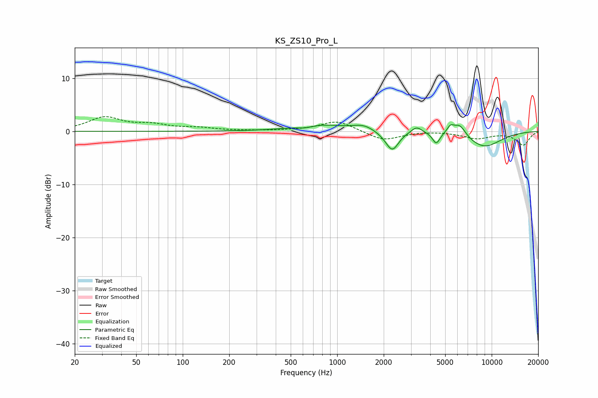

# KS_ZS10_Pro_L
See [usage instructions](https://github.com/jaakkopasanen/AutoEq#usage) for more options and info.

### Parametric EQs
Apply preamp of -1.4 dB when using parametric equalizer.

|   # | Type    |   Fc (Hz) |    Q |   Gain (dB) |
|-----|---------|-----------|------|-------------|
|   1 | Peaking |       621 | 2.82 |        -0.4 |
|   2 | Peaking |       767 | 0.87 |         1.2 |
|   3 | Peaking |      1485 | 2.08 |         1   |
|   4 | Peaking |      2099 | 2.43 |        -0.5 |
|   5 | Peaking |      2277 | 3.54 |        -3.3 |
|   6 | Peaking |      3262 | 3.99 |         1.3 |
|   7 | Peaking |      4376 | 5.94 |        -2.1 |
|   8 | Peaking |      5410 | 6    |         1.3 |
|   9 | Peaking |      6209 | 3.34 |         2.3 |
|  10 | Peaking |      8887 | 1.1  |        -3   |

### Fixed Band EQs
When using fixed band (also called graphic) equalizer, apply preamp of **-2.9 dB** (if available) and set gains manually with these parameters.

|   # | Type    |   Fc (Hz) |    Q |   Gain (dB) |
|-----|---------|-----------|------|-------------|
|   1 | Peaking |        31 | 1.41 |         2.5 |
|   2 | Peaking |        62 | 1.41 |         1.1 |
|   3 | Peaking |       125 | 1.41 |         0.5 |
|   4 | Peaking |       250 | 1.41 |         0.1 |
|   5 | Peaking |       500 | 1.41 |         0.1 |
|   6 | Peaking |      1000 | 1.41 |         2   |
|   7 | Peaking |      2000 | 1.41 |        -1.8 |
|   8 | Peaking |      4000 | 1.41 |         0.1 |
|   9 | Peaking |      8000 | 1.41 |        -1.3 |
|  10 | Peaking |     16000 | 1.41 |        -2.5 |

### Graphs

