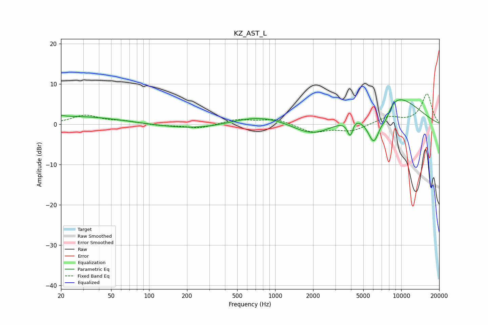

# KZ_AST_L
See [usage instructions](https://github.com/jaakkopasanen/AutoEq#usage) for more options and info.

### Parametric EQs
Apply preamp of -6.1 dB when using parametric equalizer.

|   # | Type    |   Fc (Hz) |    Q |   Gain (dB) |
|-----|---------|-----------|------|-------------|
|   1 | Peaking |        20 | 5.84 |         0.4 |
|   2 | Peaking |        26 | 0.4  |         1.9 |
|   3 | Peaking |       303 | 0.44 |        -1.9 |
|   4 | Peaking |       729 | 0.51 |         3.2 |
|   5 | Peaking |      1986 | 0.83 |        -4.1 |
|   6 | Peaking |      3945 | 6    |        -4.1 |
|   7 | Peaking |      4258 | 5.69 |         0.7 |
|   8 | Peaking |      6076 | 2.29 |       -10.2 |
|   9 | Peaking |      7544 | 3.49 |        -2.8 |
|  10 | Peaking |      8069 | 0.58 |         8.7 |

### Fixed Band EQs
When using fixed band (also called graphic) equalizer, apply preamp of **-7.6 dB** (if available) and set gains manually with these parameters.

|   # | Type    |   Fc (Hz) |    Q |   Gain (dB) |
|-----|---------|-----------|------|-------------|
|   1 | Peaking |        31 | 1.41 |         2.1 |
|   2 | Peaking |        62 | 1.41 |         0.6 |
|   3 | Peaking |       125 | 1.41 |        -0.4 |
|   4 | Peaking |       250 | 1.41 |        -1.1 |
|   5 | Peaking |       500 | 1.41 |         1.2 |
|   6 | Peaking |      1000 | 1.41 |         1.3 |
|   7 | Peaking |      2000 | 1.41 |        -2   |
|   8 | Peaking |      4000 | 1.41 |        -1.7 |
|   9 | Peaking |      8000 | 1.41 |         1.8 |
|  10 | Peaking |     16000 | 1.41 |         7.5 |

### Graphs

