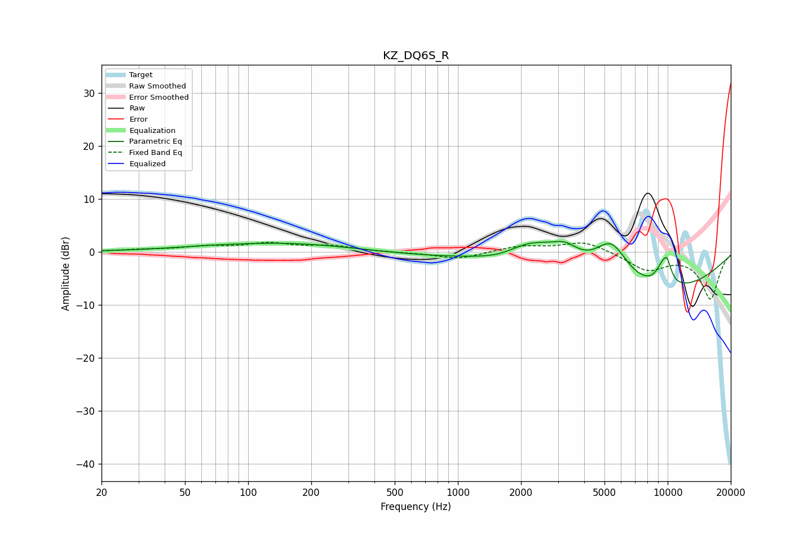

# KZ_DQ6S_R
See [usage instructions](https://github.com/jaakkopasanen/AutoEq#usage) for more options and info.

### Parametric EQs
Apply preamp of -2.1 dB when using parametric equalizer.

|   # | Type    |   Fc (Hz) |    Q |   Gain (dB) |
|-----|---------|-----------|------|-------------|
|   1 | Peaking |        59 | 0.64 |         0.3 |
|   2 | Peaking |       152 | 0.45 |         1.6 |
|   3 | Peaking |      1502 | 0.35 |        -1.4 |
|   4 | Peaking |      1639 | 1.25 |        -1.7 |
|   5 | Peaking |      2212 | 0.89 |         6   |
|   6 | Peaking |      3245 | 2.15 |         2.6 |
|   7 | Peaking |      5387 | 1.63 |         7.8 |
|   8 | Peaking |      7914 | 0.32 |        -8.3 |
|   9 | Peaking |      9405 | 3.87 |         3.2 |
|  10 | Peaking |      9945 | 5.95 |         3.2 |

### Fixed Band EQs
When using fixed band (also called graphic) equalizer, apply preamp of **-1.9 dB** (if available) and set gains manually with these parameters.

|   # | Type    |   Fc (Hz) |    Q |   Gain (dB) |
|-----|---------|-----------|------|-------------|
|   1 | Peaking |        31 | 1.41 |         0.3 |
|   2 | Peaking |        62 | 1.41 |         0.9 |
|   3 | Peaking |       125 | 1.41 |         1.4 |
|   4 | Peaking |       250 | 1.41 |         1   |
|   5 | Peaking |       500 | 1.41 |        -0.1 |
|   6 | Peaking |      1000 | 1.41 |        -1.4 |
|   7 | Peaking |      2000 | 1.41 |         1.1 |
|   8 | Peaking |      4000 | 1.41 |         2   |
|   9 | Peaking |      8000 | 1.41 |        -3.3 |
|  10 | Peaking |     16000 | 1.41 |        -8.8 |

### Graphs

