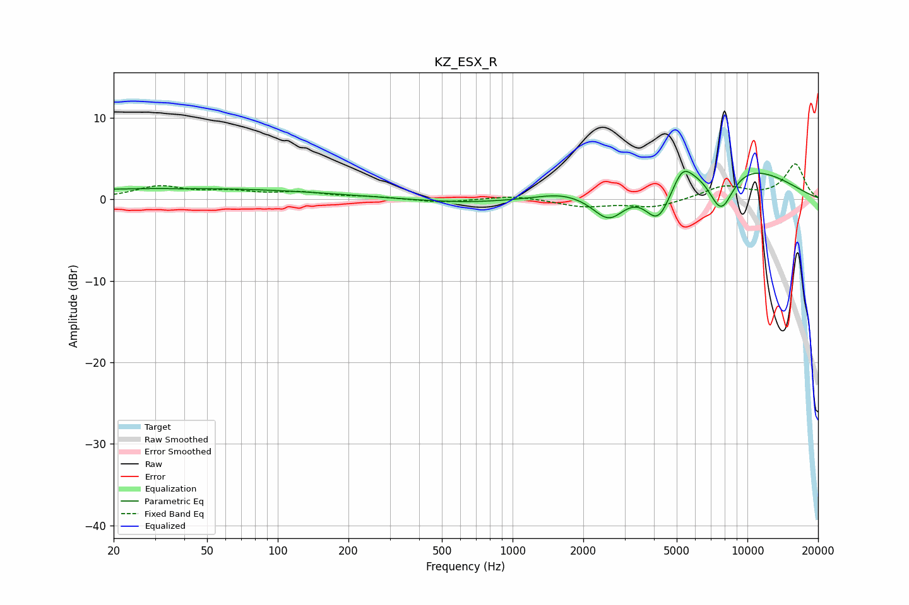

# KZ_ESX_R
See [usage instructions](https://github.com/jaakkopasanen/AutoEq#usage) for more options and info.

### Parametric EQs
Apply preamp of -3.5 dB when using parametric equalizer.

|   # | Type    |   Fc (Hz) |    Q |   Gain (dB) |
|-----|---------|-----------|------|-------------|
|   1 | Peaking |        37 | 0.2  |         1.3 |
|   2 | Peaking |        39 | 5.95 |        -0   |
|   3 | Peaking |        43 | 3.28 |         0   |
|   4 | Peaking |       673 | 0.63 |        -0.6 |
|   5 | Peaking |      1583 | 1.74 |         0.4 |
|   6 | Peaking |      2577 | 1.9  |        -4.1 |
|   7 | Peaking |      4170 | 2.32 |        -5.5 |
|   8 | Peaking |      5291 | 3.67 |         1.9 |
|   9 | Peaking |      6895 | 0.4  |         5.5 |
|  10 | Peaking |      7714 | 2.31 |        -5.9 |

### Fixed Band EQs
When using fixed band (also called graphic) equalizer, apply preamp of **-4.4 dB** (if available) and set gains manually with these parameters.

|   # | Type    |   Fc (Hz) |    Q |   Gain (dB) |
|-----|---------|-----------|------|-------------|
|   1 | Peaking |        31 | 1.41 |         1.5 |
|   2 | Peaking |        62 | 1.41 |         0.8 |
|   3 | Peaking |       125 | 1.41 |         0.7 |
|   4 | Peaking |       250 | 1.41 |         0.3 |
|   5 | Peaking |       500 | 1.41 |        -0.4 |
|   6 | Peaking |      1000 | 1.41 |         0.5 |
|   7 | Peaking |      2000 | 1.41 |        -0.9 |
|   8 | Peaking |      4000 | 1.41 |        -1   |
|   9 | Peaking |      8000 | 1.41 |         1.6 |
|  10 | Peaking |     16000 | 1.41 |         4.3 |

### Graphs

