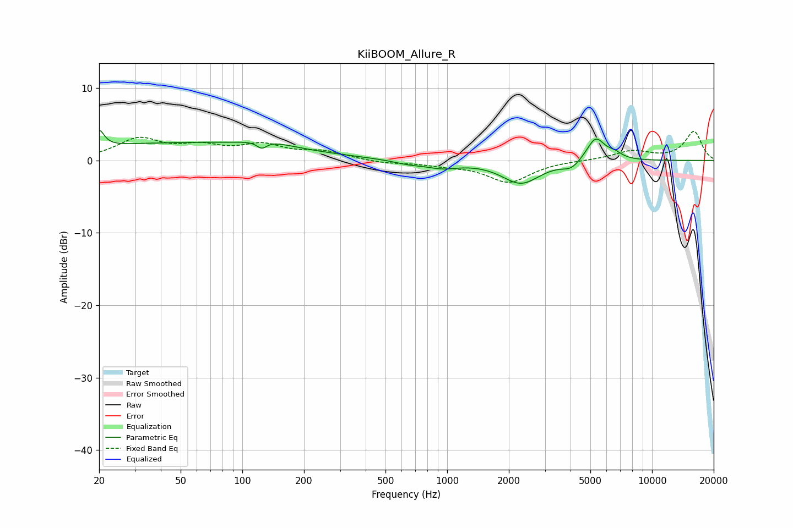

# KiiBOOM_Allure_R
See [usage instructions](https://github.com/jaakkopasanen/AutoEq#usage) for more options and info.

### Parametric EQs
Apply preamp of -4.3 dB when using parametric equalizer.

|   # | Type    |   Fc (Hz) |    Q |   Gain (dB) |
|-----|---------|-----------|------|-------------|
|   1 | Peaking |        20 | 6    |         2.3 |
|   2 | Peaking |        52 | 0.24 |         2.4 |
|   3 | Peaking |       124 | 6    |        -1   |
|   4 | Peaking |       133 | 1.3  |         0.7 |
|   5 | Peaking |       649 | 1.84 |        -0.5 |
|   6 | Peaking |       949 | 1.82 |        -0.9 |
|   7 | Peaking |      2292 | 1.52 |        -3.1 |
|   8 | Peaking |      4033 | 3.31 |        -1   |
|   9 | Peaking |      5307 | 3.13 |         3.3 |
|  10 | Peaking |      6560 | 3.74 |         0.7 |

### Fixed Band EQs
When using fixed band (also called graphic) equalizer, apply preamp of **-4.1 dB** (if available) and set gains manually with these parameters.

|   # | Type    |   Fc (Hz) |    Q |   Gain (dB) |
|-----|---------|-----------|------|-------------|
|   1 | Peaking |        31 | 1.41 |         2.8 |
|   2 | Peaking |        62 | 1.41 |         1.6 |
|   3 | Peaking |       125 | 1.41 |         1.9 |
|   4 | Peaking |       250 | 1.41 |         1.1 |
|   5 | Peaking |       500 | 1.41 |        -0.4 |
|   6 | Peaking |      1000 | 1.41 |        -0.5 |
|   7 | Peaking |      2000 | 1.41 |        -3   |
|   8 | Peaking |      4000 | 1.41 |         0   |
|   9 | Peaking |      8000 | 1.41 |         1.3 |
|  10 | Peaking |     16000 | 1.41 |         4   |

### Graphs

