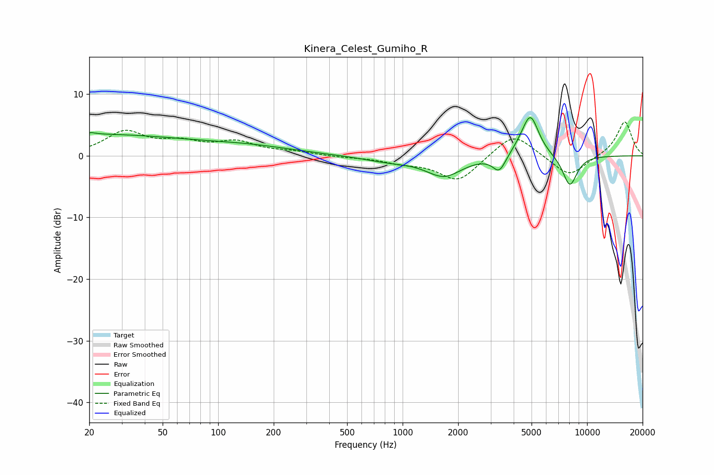

# Kinera_Celest_Gumiho_R
See [usage instructions](https://github.com/jaakkopasanen/AutoEq#usage) for more options and info.

### Parametric EQs
Apply preamp of -6.3 dB when using parametric equalizer.

|   # | Type    |   Fc (Hz) |    Q |   Gain (dB) |
|-----|---------|-----------|------|-------------|
|   1 | Peaking |        20 | 0.25 |         3.4 |
|   2 | Peaking |        20 | 6    |        -2.9 |
|   3 | Peaking |        20 | 5.89 |         3.1 |
|   4 | Peaking |       150 | 0.56 |         1.1 |
|   5 | Peaking |       838 | 1    |        -0.8 |
|   6 | Peaking |      1677 | 1.45 |        -3.2 |
|   7 | Peaking |      3343 | 3.97 |        -2.7 |
|   8 | Peaking |      4533 | 2.27 |         0.9 |
|   9 | Peaking |      4935 | 3.06 |         6.2 |
|  10 | Peaking |      8064 | 3.3  |        -5   |

### Fixed Band EQs
When using fixed band (also called graphic) equalizer, apply preamp of **-5.6 dB** (if available) and set gains manually with these parameters.

|   # | Type    |   Fc (Hz) |    Q |   Gain (dB) |
|-----|---------|-----------|------|-------------|
|   1 | Peaking |        31 | 1.41 |         3.7 |
|   2 | Peaking |        62 | 1.41 |         1.8 |
|   3 | Peaking |       125 | 1.41 |         2   |
|   4 | Peaking |       250 | 1.41 |         0.5 |
|   5 | Peaking |       500 | 1.41 |        -0.2 |
|   6 | Peaking |      1000 | 1.41 |        -0.9 |
|   7 | Peaking |      2000 | 1.41 |        -4.2 |
|   8 | Peaking |      4000 | 1.41 |         3.9 |
|   9 | Peaking |      8000 | 1.41 |        -3.5 |
|  10 | Peaking |     16000 | 1.41 |         5.6 |

### Graphs

