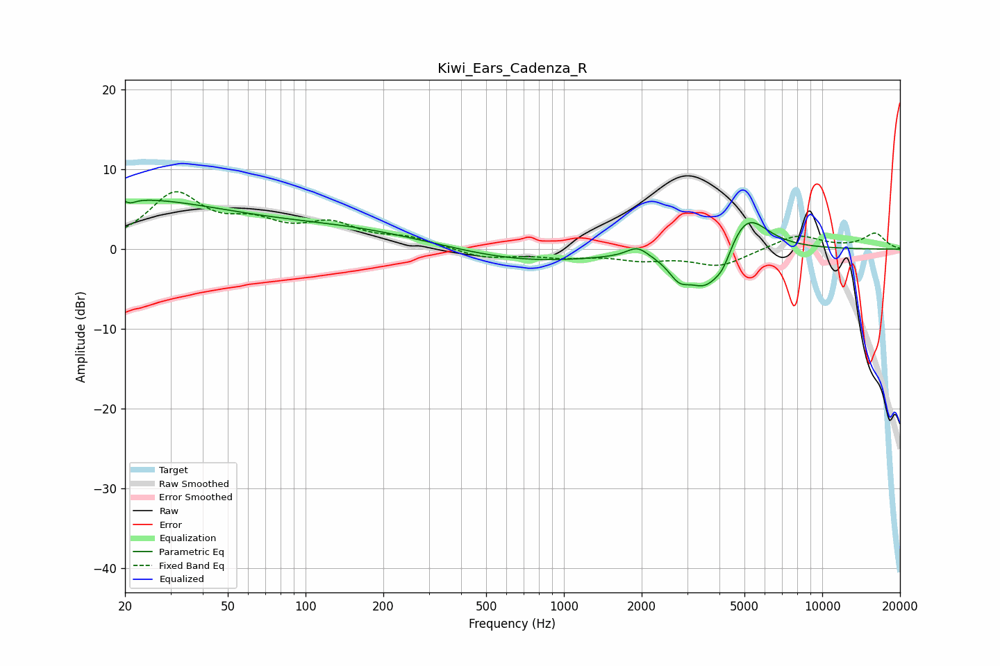

# Kiwi_Ears_Cadenza_R
See [usage instructions](https://github.com/jaakkopasanen/AutoEq#usage) for more options and info.

### Parametric EQs
Apply preamp of -6.2 dB when using parametric equalizer.

|   # | Type    |   Fc (Hz) |    Q |   Gain (dB) |
|-----|---------|-----------|------|-------------|
|   1 | Peaking |        20 | 0.35 |         6   |
|   2 | Peaking |        21 | 5.7  |         3.3 |
|   3 | Peaking |        21 | 5.9  |        -3.7 |
|   4 | Peaking |       147 | 0.41 |         2.3 |
|   5 | Peaking |       695 | 0.47 |        -1.7 |
|   6 | Peaking |      1926 | 3.43 |         1.3 |
|   7 | Peaking |      2792 | 3.42 |        -2.3 |
|   8 | Peaking |      3545 | 2.01 |        -4.9 |
|   9 | Peaking |      4130 | 4.26 |        -1.7 |
|  10 | Peaking |      5079 | 1.71 |         5.1 |

### Fixed Band EQs
When using fixed band (also called graphic) equalizer, apply preamp of **-7.3 dB** (if available) and set gains manually with these parameters.

|   # | Type    |   Fc (Hz) |    Q |   Gain (dB) |
|-----|---------|-----------|------|-------------|
|   1 | Peaking |        31 | 1.41 |         6.6 |
|   2 | Peaking |        62 | 1.41 |         2.6 |
|   3 | Peaking |       125 | 1.41 |         2.7 |
|   4 | Peaking |       250 | 1.41 |         1.2 |
|   5 | Peaking |       500 | 1.41 |        -1.1 |
|   6 | Peaking |      1000 | 1.41 |        -0.8 |
|   7 | Peaking |      2000 | 1.41 |        -1.1 |
|   8 | Peaking |      4000 | 1.41 |        -2.1 |
|   9 | Peaking |      8000 | 1.41 |         1.8 |
|  10 | Peaking |     16000 | 1.41 |         2   |

### Graphs

