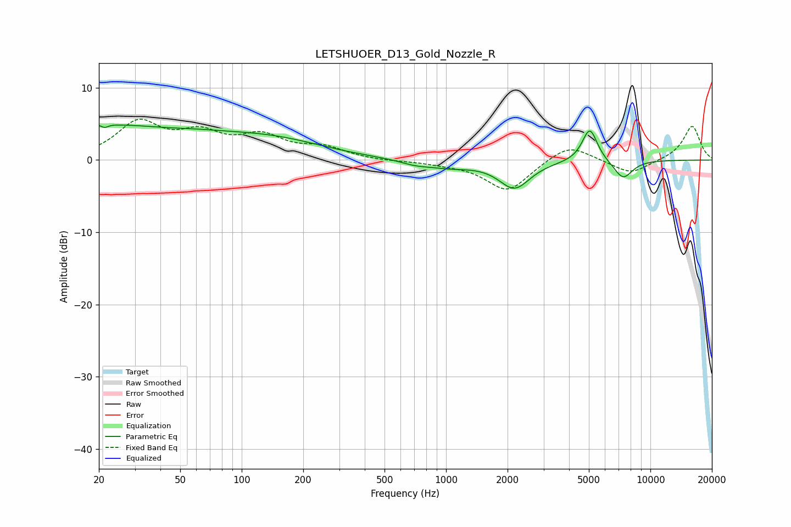

# LETSHUOER_D13_Gold_Nozzle_R
See [usage instructions](https://github.com/jaakkopasanen/AutoEq#usage) for more options and info.

### Parametric EQs
Apply preamp of -4.9 dB when using parametric equalizer.

|   # | Type    |   Fc (Hz) |    Q |   Gain (dB) |
|-----|---------|-----------|------|-------------|
|   1 | Peaking |        21 | 5.5  |         3.4 |
|   2 | Peaking |        21 | 5.99 |        -3.7 |
|   3 | Peaking |        22 | 0.23 |         4.7 |
|   4 | Peaking |        42 | 1.49 |        -0.2 |
|   5 | Peaking |       153 | 0.58 |         1.9 |
|   6 | Peaking |       700 | 2.05 |        -0.5 |
|   7 | Peaking |      1022 | 1.15 |        -0.9 |
|   8 | Peaking |      2162 | 1.86 |        -3.8 |
|   9 | Peaking |      5051 | 3.75 |         4.7 |
|  10 | Peaking |      7351 | 2.88 |        -2.6 |

### Fixed Band EQs
When using fixed band (also called graphic) equalizer, apply preamp of **-5.7 dB** (if available) and set gains manually with these parameters.

|   # | Type    |   Fc (Hz) |    Q |   Gain (dB) |
|-----|---------|-----------|------|-------------|
|   1 | Peaking |        31 | 1.41 |         4.9 |
|   2 | Peaking |        62 | 1.41 |         3.1 |
|   3 | Peaking |       125 | 1.41 |         2.9 |
|   4 | Peaking |       250 | 1.41 |         1.5 |
|   5 | Peaking |       500 | 1.41 |        -0.2 |
|   6 | Peaking |      1000 | 1.41 |        -0.4 |
|   7 | Peaking |      2000 | 1.41 |        -4.3 |
|   8 | Peaking |      4000 | 1.41 |         2.4 |
|   9 | Peaking |      8000 | 1.41 |        -2   |
|  10 | Peaking |     16000 | 1.41 |         4.8 |

### Graphs

