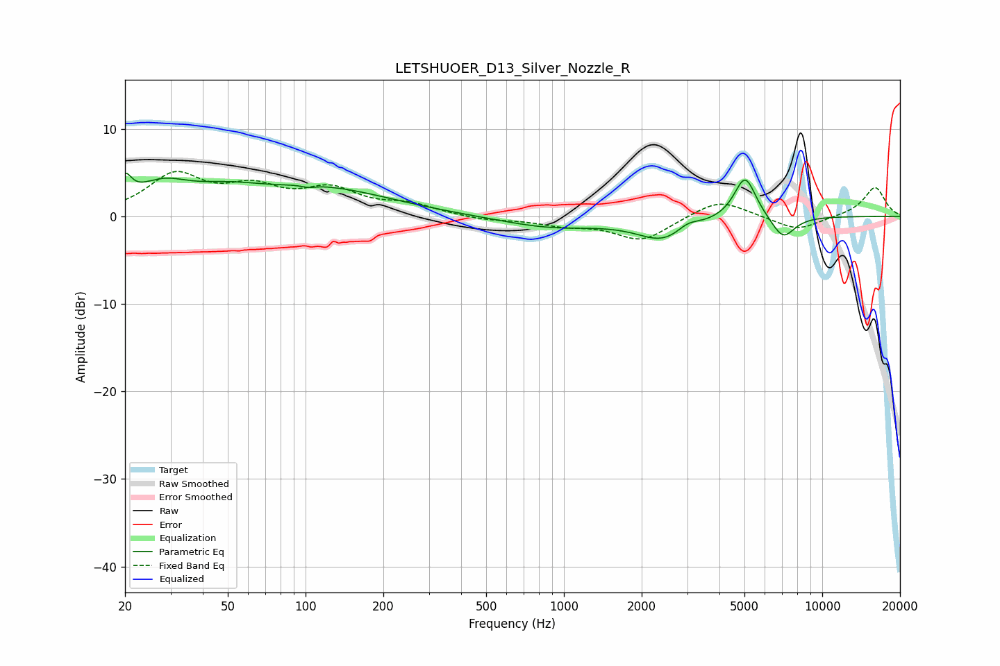

# LETSHUOER_D13_Silver_Nozzle_R
See [usage instructions](https://github.com/jaakkopasanen/AutoEq#usage) for more options and info.

### Parametric EQs
Apply preamp of -5.0 dB when using parametric equalizer.

|   # | Type    |   Fc (Hz) |    Q |   Gain (dB) |
|-----|---------|-----------|------|-------------|
|   1 | Peaking |        20 | 5.76 |         2.6 |
|   2 | Peaking |        28 | 1.29 |         3   |
|   3 | Peaking |        50 | 1.05 |         1.6 |
|   4 | Peaking |       103 | 5.86 |        -0.3 |
|   5 | Peaking |       115 | 0.53 |         3.1 |
|   6 | Peaking |       890 | 0.73 |        -1.3 |
|   7 | Peaking |      2440 | 1.37 |        -2.6 |
|   8 | Peaking |      3014 | 3.2  |         0.9 |
|   9 | Peaking |      5027 | 3.26 |         5   |
|  10 | Peaking |      7054 | 2.97 |        -2.6 |

### Fixed Band EQs
When using fixed band (also called graphic) equalizer, apply preamp of **-5.2 dB** (if available) and set gains manually with these parameters.

|   # | Type    |   Fc (Hz) |    Q |   Gain (dB) |
|-----|---------|-----------|------|-------------|
|   1 | Peaking |        31 | 1.41 |         4.5 |
|   2 | Peaking |        62 | 1.41 |         2.7 |
|   3 | Peaking |       125 | 1.41 |         2.7 |
|   4 | Peaking |       250 | 1.41 |         1.2 |
|   5 | Peaking |       500 | 1.41 |        -0.4 |
|   6 | Peaking |      1000 | 1.41 |        -0.8 |
|   7 | Peaking |      2000 | 1.41 |        -2.7 |
|   8 | Peaking |      4000 | 1.41 |         2.1 |
|   9 | Peaking |      8000 | 1.41 |        -1.7 |
|  10 | Peaking |     16000 | 1.41 |         3.4 |

### Graphs

