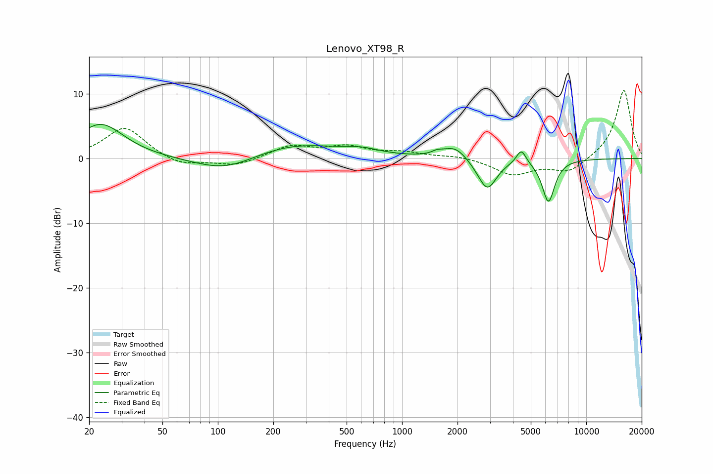

# Lenovo_XT98_R
See [usage instructions](https://github.com/jaakkopasanen/AutoEq#usage) for more options and info.

### Parametric EQs
Apply preamp of -5.4 dB when using parametric equalizer.

|   # | Type    |   Fc (Hz) |    Q |   Gain (dB) |
|-----|---------|-----------|------|-------------|
|   1 | Peaking |        23 | 1.13 |         5.4 |
|   2 | Peaking |       110 | 0.84 |        -2.4 |
|   3 | Peaking |       254 | 0.57 |         2.4 |
|   4 | Peaking |       605 | 1.42 |         0.8 |
|   5 | Peaking |      1548 | 5.22 |         0.4 |
|   6 | Peaking |      1933 | 2.09 |         2.1 |
|   7 | Peaking |      2710 | 2.2  |        -0.7 |
|   8 | Peaking |      2913 | 2.86 |        -4.3 |
|   9 | Peaking |      4439 | 5.34 |         2.2 |
|  10 | Peaking |      6234 | 3.99 |        -6.6 |

### Fixed Band EQs
When using fixed band (also called graphic) equalizer, apply preamp of **-10.6 dB** (if available) and set gains manually with these parameters.

|   # | Type    |   Fc (Hz) |    Q |   Gain (dB) |
|-----|---------|-----------|------|-------------|
|   1 | Peaking |        31 | 1.41 |         4.9 |
|   2 | Peaking |        62 | 1.41 |        -1.3 |
|   3 | Peaking |       125 | 1.41 |        -1.2 |
|   4 | Peaking |       250 | 1.41 |         1.9 |
|   5 | Peaking |       500 | 1.41 |         1.7 |
|   6 | Peaking |      1000 | 1.41 |         0.8 |
|   7 | Peaking |      2000 | 1.41 |         0.4 |
|   8 | Peaking |      4000 | 1.41 |        -2.5 |
|   9 | Peaking |      8000 | 1.41 |        -2.1 |
|  10 | Peaking |     16000 | 1.41 |        10.7 |

### Graphs

