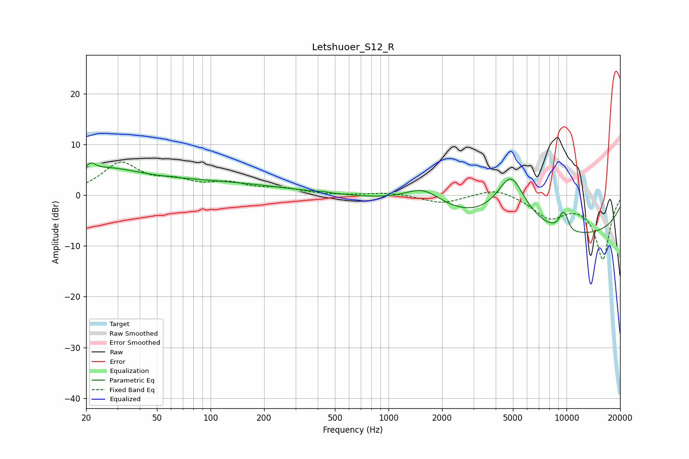

# Letshuoer_S12_R
See [usage instructions](https://github.com/jaakkopasanen/AutoEq#usage) for more options and info.

### Parametric EQs
Apply preamp of -6.4 dB when using parametric equalizer.

|   # | Type    |   Fc (Hz) |    Q |   Gain (dB) |
|-----|---------|-----------|------|-------------|
|   1 | Peaking |        21 | 5.54 |         1.5 |
|   2 | Peaking |        26 | 0.85 |         2.5 |
|   3 | Peaking |        48 | 0.18 |         2.9 |
|   4 | Peaking |       430 | 5.99 |         0.2 |
|   5 | Peaking |      1569 | 1.32 |         3.8 |
|   6 | Peaking |      4877 | 1.58 |        10.6 |
|   7 | Peaking |      8878 | 0.18 |        -8.3 |
|   8 | Peaking |      9452 | 5.77 |         2.4 |
|   9 | Peaking |      9913 | 5.75 |         2.8 |
|  10 | Peaking |     10000 | 3.88 |        -1   |

### Fixed Band EQs
When using fixed band (also called graphic) equalizer, apply preamp of **-6.6 dB** (if available) and set gains manually with these parameters.

|   # | Type    |   Fc (Hz) |    Q |   Gain (dB) |
|-----|---------|-----------|------|-------------|
|   1 | Peaking |        31 | 1.41 |         6   |
|   2 | Peaking |        62 | 1.41 |         2.1 |
|   3 | Peaking |       125 | 1.41 |         2   |
|   4 | Peaking |       250 | 1.41 |         1.1 |
|   5 | Peaking |       500 | 1.41 |        -0.1 |
|   6 | Peaking |      1000 | 1.41 |         0.5 |
|   7 | Peaking |      2000 | 1.41 |        -1.6 |
|   8 | Peaking |      4000 | 1.41 |         1.6 |
|   9 | Peaking |      8000 | 1.41 |        -4.1 |
|  10 | Peaking |     16000 | 1.41 |       -12.5 |

### Graphs

