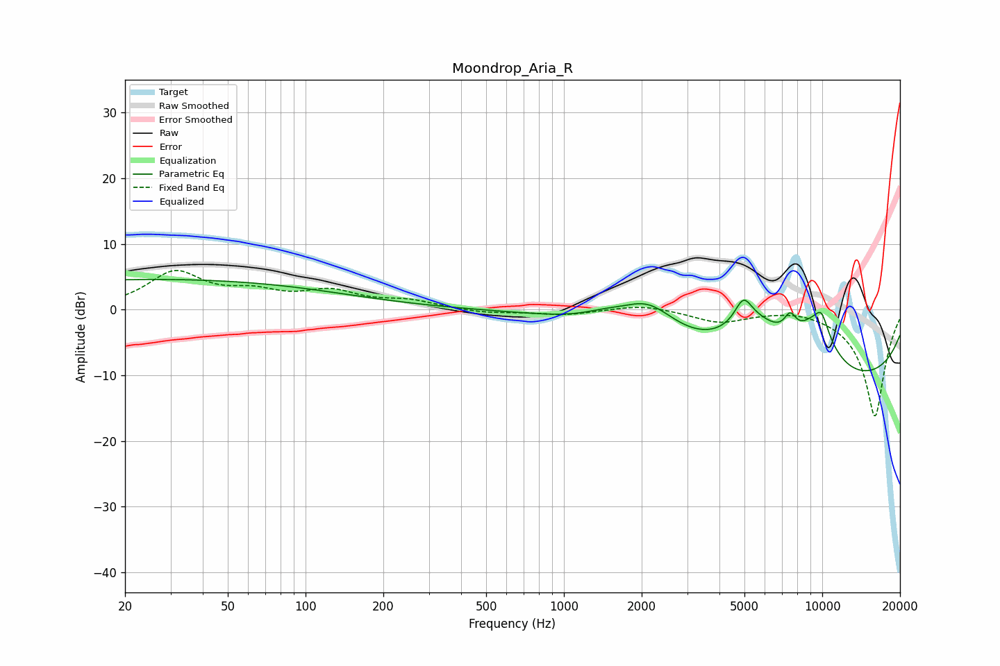

# Moondrop_Aria_R
See [usage instructions](https://github.com/jaakkopasanen/AutoEq#usage) for more options and info.

### Parametric EQs
Apply preamp of -4.7 dB when using parametric equalizer.

|   # | Type    |   Fc (Hz) |    Q |   Gain (dB) |
|-----|---------|-----------|------|-------------|
|   1 | Peaking |        26 | 0.18 |         4.6 |
|   2 | Peaking |      1428 | 1.68 |         1   |
|   3 | Peaking |      2118 | 1.27 |         5.2 |
|   4 | Peaking |      4951 | 4.18 |         3.7 |
|   5 | Peaking |      5517 | 1.11 |         6.8 |
|   6 | Peaking |      7517 | 5.55 |         2.8 |
|   7 | Peaking |      9464 | 1.73 |         8.1 |
|   8 | Peaking |      9728 | 3.32 |        -2.4 |
|   9 | Peaking |      9782 | 0.19 |       -11.8 |
|  10 | Peaking |      9917 | 4.53 |         3.9 |

### Fixed Band EQs
When using fixed band (also called graphic) equalizer, apply preamp of **-6.1 dB** (if available) and set gains manually with these parameters.

|   # | Type    |   Fc (Hz) |    Q |   Gain (dB) |
|-----|---------|-----------|------|-------------|
|   1 | Peaking |        31 | 1.41 |         5.5 |
|   2 | Peaking |        62 | 1.41 |         2.1 |
|   3 | Peaking |       125 | 1.41 |         2.5 |
|   4 | Peaking |       250 | 1.41 |         1.2 |
|   5 | Peaking |       500 | 1.41 |        -0.6 |
|   6 | Peaking |      1000 | 1.41 |        -0.8 |
|   7 | Peaking |      2000 | 1.41 |         0.8 |
|   8 | Peaking |      4000 | 1.41 |        -1.9 |
|   9 | Peaking |      8000 | 1.41 |         0.5 |
|  10 | Peaking |     16000 | 1.41 |       -16.4 |

### Graphs

