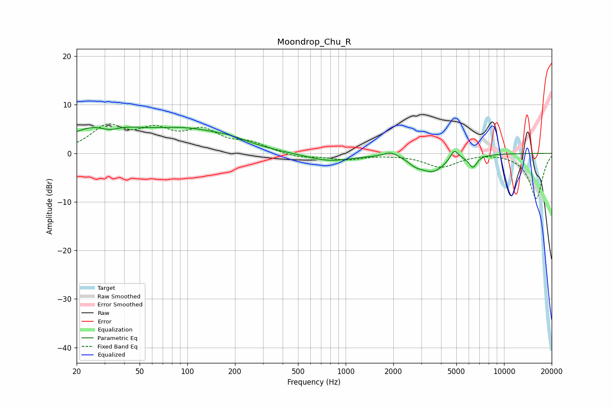

# Moondrop_Chu_R
See [usage instructions](https://github.com/jaakkopasanen/AutoEq#usage) for more options and info.

### Parametric EQs
Apply preamp of -5.5 dB when using parametric equalizer.

|   # | Type    |   Fc (Hz) |    Q |   Gain (dB) |
|-----|---------|-----------|------|-------------|
|   1 | Peaking |        29 | 0.71 |         5.5 |
|   2 | Peaking |        32 | 2.14 |        -1.7 |
|   3 | Peaking |       100 | 0.57 |         4.1 |
|   4 | Peaking |       190 | 1.22 |         0.9 |
|   5 | Peaking |       784 | 0.95 |        -1.6 |
|   6 | Peaking |      1935 | 3.09 |         1.1 |
|   7 | Peaking |      2751 | 3.7  |        -0.8 |
|   8 | Peaking |      3524 | 1.63 |        -3.7 |
|   9 | Peaking |      4849 | 5.33 |         2.2 |
|  10 | Peaking |      6360 | 5.35 |        -2.4 |

### Fixed Band EQs
When using fixed band (also called graphic) equalizer, apply preamp of **-6.2 dB** (if available) and set gains manually with these parameters.

|   # | Type    |   Fc (Hz) |    Q |   Gain (dB) |
|-----|---------|-----------|------|-------------|
|   1 | Peaking |        31 | 1.41 |         5.1 |
|   2 | Peaking |        62 | 1.41 |         4   |
|   3 | Peaking |       125 | 1.41 |         4.1 |
|   4 | Peaking |       250 | 1.41 |         1.8 |
|   5 | Peaking |       500 | 1.41 |        -0.9 |
|   6 | Peaking |      1000 | 1.41 |        -1.2 |
|   7 | Peaking |      2000 | 1.41 |        -0.1 |
|   8 | Peaking |      4000 | 1.41 |        -2.7 |
|   9 | Peaking |      8000 | 1.41 |         0.2 |
|  10 | Peaking |     16000 | 1.41 |        -9.3 |

### Graphs

