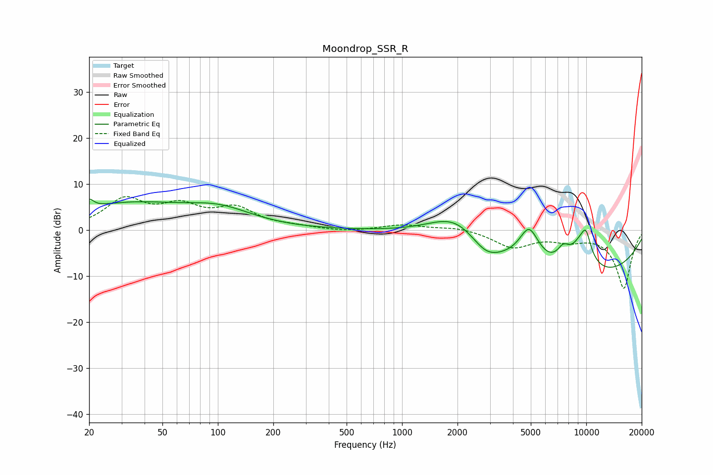

# Moondrop_SSR_R
See [usage instructions](https://github.com/jaakkopasanen/AutoEq#usage) for more options and info.

### Parametric EQs
Apply preamp of -6.8 dB when using parametric equalizer.

|   # | Type    |   Fc (Hz) |    Q |   Gain (dB) |
|-----|---------|-----------|------|-------------|
|   1 | Peaking |        20 | 6    |         1.9 |
|   2 | Peaking |        32 | 0.44 |         5.4 |
|   3 | Peaking |       103 | 0.77 |         3.4 |
|   4 | Peaking |      1961 | 0.92 |         6.5 |
|   5 | Peaking |      2856 | 1.78 |        -3.1 |
|   6 | Peaking |      4894 | 2.42 |         8   |
|   7 | Peaking |      7507 | 3.8  |         3.1 |
|   8 | Peaking |      8778 | 0.25 |       -11   |
|   9 | Peaking |      9400 | 1.97 |         6.7 |
|  10 | Peaking |      9976 | 4.99 |         3.8 |

### Fixed Band EQs
When using fixed band (also called graphic) equalizer, apply preamp of **-7.4 dB** (if available) and set gains manually with these parameters.

|   # | Type    |   Fc (Hz) |    Q |   Gain (dB) |
|-----|---------|-----------|------|-------------|
|   1 | Peaking |        31 | 1.41 |         6.3 |
|   2 | Peaking |        62 | 1.41 |         4.4 |
|   3 | Peaking |       125 | 1.41 |         4.2 |
|   4 | Peaking |       250 | 1.41 |         0.6 |
|   5 | Peaking |       500 | 1.41 |        -0.4 |
|   6 | Peaking |      1000 | 1.41 |         1.1 |
|   7 | Peaking |      2000 | 1.41 |         0.7 |
|   8 | Peaking |      4000 | 1.41 |        -3.6 |
|   9 | Peaking |      8000 | 1.41 |        -1.7 |
|  10 | Peaking |     16000 | 1.41 |       -12.6 |

### Graphs

