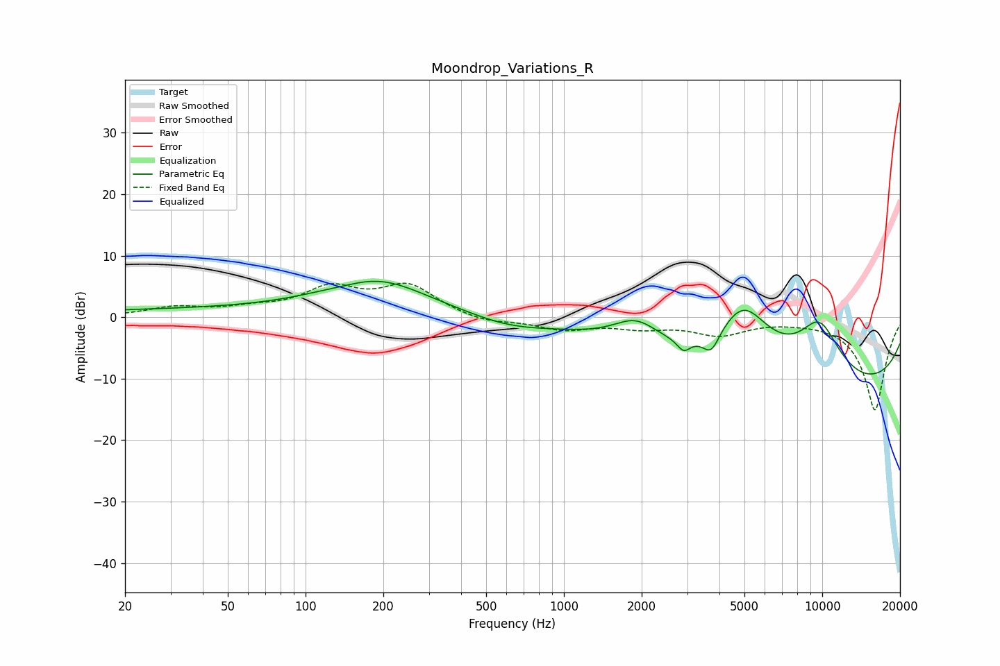

# Moondrop_Variations_R
See [usage instructions](https://github.com/jaakkopasanen/AutoEq#usage) for more options and info.

### Parametric EQs
Apply preamp of -5.9 dB when using parametric equalizer.

|   # | Type    |   Fc (Hz) |    Q |   Gain (dB) |
|-----|---------|-----------|------|-------------|
|   1 | Peaking |        46 | 0.2  |         1.2 |
|   2 | Peaking |       147 | 2    |        -0.3 |
|   3 | Peaking |       190 | 0.72 |         5.5 |
|   4 | Peaking |       612 | 0.93 |        -1.5 |
|   5 | Peaking |      1901 | 1.59 |         3.9 |
|   6 | Peaking |      2908 | 5.69 |        -1.9 |
|   7 | Peaking |      3718 | 4.35 |        -3.4 |
|   8 | Peaking |      4957 | 1.21 |        10.9 |
|   9 | Peaking |      9734 | 0.18 |       -12.7 |
|  10 | Peaking |      9756 | 1.37 |         9.7 |

### Fixed Band EQs
When using fixed band (also called graphic) equalizer, apply preamp of **-5.6 dB** (if available) and set gains manually with these parameters.

|   # | Type    |   Fc (Hz) |    Q |   Gain (dB) |
|-----|---------|-----------|------|-------------|
|   1 | Peaking |        31 | 1.41 |         1.5 |
|   2 | Peaking |        62 | 1.41 |         1.1 |
|   3 | Peaking |       125 | 1.41 |         4.3 |
|   4 | Peaking |       250 | 1.41 |         4.9 |
|   5 | Peaking |       500 | 1.41 |        -1   |
|   6 | Peaking |      1000 | 1.41 |        -1.9 |
|   7 | Peaking |      2000 | 1.41 |        -1.4 |
|   8 | Peaking |      4000 | 1.41 |        -2.6 |
|   9 | Peaking |      8000 | 1.41 |        -0.2 |
|  10 | Peaking |     16000 | 1.41 |       -15.2 |

### Graphs

