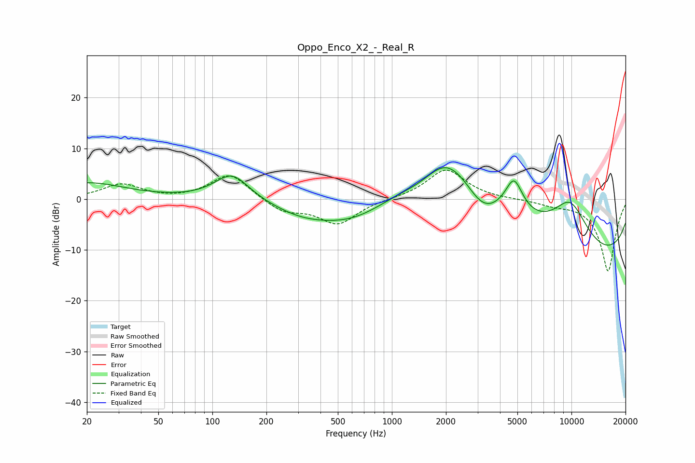

# Oppo_Enco_X2_-_Real_R
See [usage instructions](https://github.com/jaakkopasanen/AutoEq#usage) for more options and info.

### Parametric EQs
Apply preamp of -6.3 dB when using parametric equalizer.

|   # | Type    |   Fc (Hz) |    Q |   Gain (dB) |
|-----|---------|-----------|------|-------------|
|   1 | Peaking |        20 | 0.66 |         3.2 |
|   2 | Peaking |       129 | 1.44 |         5.4 |
|   3 | Peaking |       310 | 1.03 |        -1.1 |
|   4 | Peaking |       620 | 0.51 |        -7.9 |
|   5 | Peaking |      1490 | 1.16 |        -2.9 |
|   6 | Peaking |      2000 | 0.51 |        18.1 |
|   7 | Peaking |      3186 | 1.44 |        -4.8 |
|   8 | Peaking |      4782 | 2.8  |         6.9 |
|   9 | Peaking |      9836 | 1.09 |        10   |
|  10 | Peaking |     10000 | 0.18 |       -13.4 |

### Fixed Band EQs
When using fixed band (also called graphic) equalizer, apply preamp of **-5.8 dB** (if available) and set gains manually with these parameters.

|   # | Type    |   Fc (Hz) |    Q |   Gain (dB) |
|-----|---------|-----------|------|-------------|
|   1 | Peaking |        31 | 1.41 |         2.9 |
|   2 | Peaking |        62 | 1.41 |        -0.2 |
|   3 | Peaking |       125 | 1.41 |         5.1 |
|   4 | Peaking |       250 | 1.41 |        -2.5 |
|   5 | Peaking |       500 | 1.41 |        -4.8 |
|   6 | Peaking |      1000 | 1.41 |         0   |
|   7 | Peaking |      2000 | 1.41 |         5.9 |
|   8 | Peaking |      4000 | 1.41 |        -0   |
|   9 | Peaking |      8000 | 1.41 |        -0.9 |
|  10 | Peaking |     16000 | 1.41 |       -14.2 |

### Graphs

