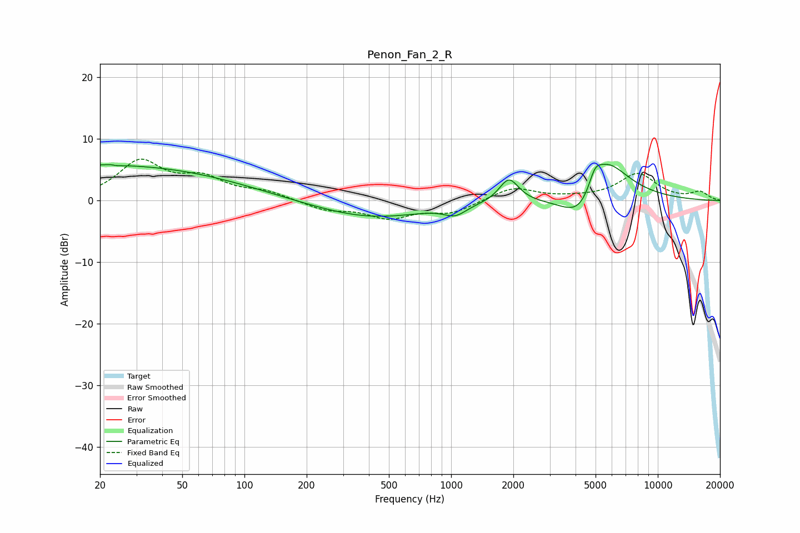

# Penon_Fan_2_R
See [usage instructions](https://github.com/jaakkopasanen/AutoEq#usage) for more options and info.

### Parametric EQs
Apply preamp of -6.0 dB when using parametric equalizer.

|   # | Type    |   Fc (Hz) |    Q |   Gain (dB) |
|-----|---------|-----------|------|-------------|
|   1 | Peaking |        20 | 0.2  |         5.8 |
|   2 | Peaking |        23 | 5.89 |         3.2 |
|   3 | Peaking |        23 | 5.79 |        -3.2 |
|   4 | Peaking |       416 | 0.47 |        -4.2 |
|   5 | Peaking |       457 | 0.38 |         1.4 |
|   6 | Peaking |      1048 | 2.62 |        -1.6 |
|   7 | Peaking |      1904 | 3.03 |         3.9 |
|   8 | Peaking |      4313 | 1.4  |        -6.7 |
|   9 | Peaking |      4956 | 4.53 |         2.7 |
|  10 | Peaking |      5530 | 1.23 |         8.9 |

### Fixed Band EQs
When using fixed band (also called graphic) equalizer, apply preamp of **-6.8 dB** (if available) and set gains manually with these parameters.

|   # | Type    |   Fc (Hz) |    Q |   Gain (dB) |
|-----|---------|-----------|------|-------------|
|   1 | Peaking |        31 | 1.41 |         6.1 |
|   2 | Peaking |        62 | 1.41 |         3.2 |
|   3 | Peaking |       125 | 1.41 |         1.3 |
|   4 | Peaking |       250 | 1.41 |        -1.5 |
|   5 | Peaking |       500 | 1.41 |        -2.6 |
|   6 | Peaking |      1000 | 1.41 |        -1.9 |
|   7 | Peaking |      2000 | 1.41 |         2.2 |
|   8 | Peaking |      4000 | 1.41 |         0.2 |
|   9 | Peaking |      8000 | 1.41 |         4.3 |
|  10 | Peaking |     16000 | 1.41 |         1.3 |

### Graphs

